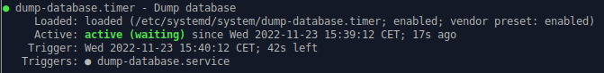
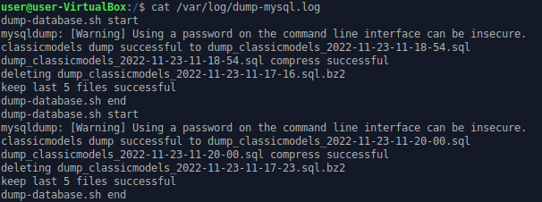
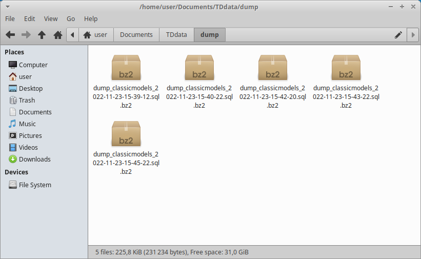

# .service

Le ``.service`` est un programme permettant d'executer des scripts.

On peut le configurer en plusieurs mode, ici nous utiliserons le ``oneshot``, il permet d'executer les scripts indiqué une fois lancé, puis se désactiver juste après.

Ici le code se compose de cette façon :

```shell
[Unit]
Description=Dump database

[Service]
ExecStart=/usr/bin/dump-database.sh

[Install]
WantedBy=multi-user.target
```

Indiquez les scripts que vous voulez lancer à l'aide de la commande ``ExecStart``.

<br/>

# .timer

Les fichiers en ``.timer`` est un programme permettant d'activer à une date ou à une frequence précise un fichier ``.service``.

Ici le code se compose de cette façon :

```shell
[Unit]
Description=Dump database

[Timer]
OnUnitActiveSec=10m

[Install]
WantedBy=timers.target
```

La commande ``OnUnitActiveSec`` sert à indiqué la fréquence d'activation du fichier ``.service``.

<br/>

# Activation du système

Après avoir modifier les fichiers précédent il est important d'utiliser la commande suivante, elle permet d'actualisé les ``daemon`` et d'appliquer ces programmes au sein du système.

```shell
sudo systemctl daemon-reload
```

<br/>

Pour activer le système complet il faut lancer le script ``dump-database.timer`` grâce à la commande suivante :

```shell
sudo systemctl start dump-database.timer
```



Ici nous pouvons voir que le programme est dans l'état ``active (waiting)``. Il attend les prochaines 10 minutes pour pouvoir s'activer.

<br/>

Nous pouvons voir ici les log du script indiquant l'activation du programme et son execution :



<br/>

Nous avons donc nos 5 fichiers compressés les plus récents conservés dans un dossier ``dump`` :



*Note : les résultats affichés ici ont été fait avec une fréquence d'activation de 1 minutes*