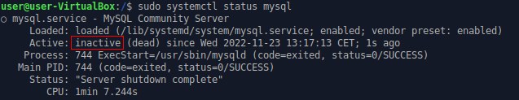
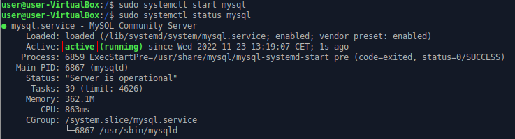
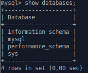
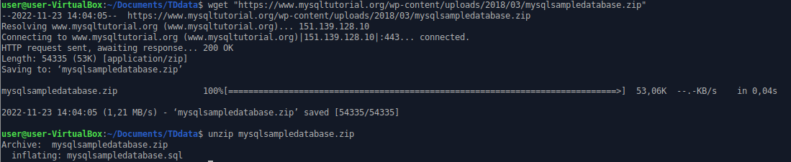
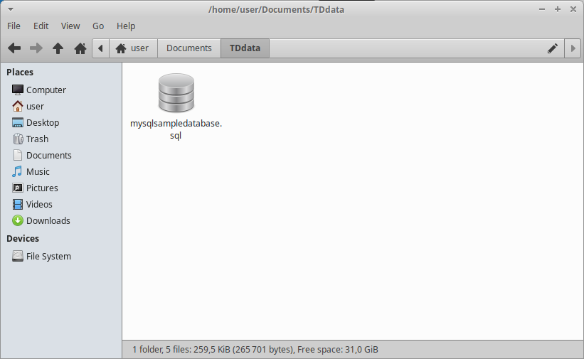
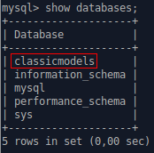

Pour ce projet j'ai utilisé **MySQL 8.0** sur Ubuntu, je vais expliquer comment l'installer puis l'utiliser.

<br />

# I - Mettre à jour ses package

Avant de commencer, il est recommandé de mettre à jour ses packages locaux avec les dernieres version disponible.

Pour ce faire vous pouvez utiliser les deux fonctions suivantes :

```shell
sudo apt update
```
```shell
sudo apt upgrade
```
<br />

# II - Installation de MySQL

Une fois les packages à jour, nous pouvons commencer à installer MySQL à l'aide de cette commande :

```shell
sudo apt-get install mysql-server
```

L'installation peut prendre un certain en fonction de votre connexion internet.

MySQL est maintenant installé sur votre ordinateur.

<br />

# III - Sécuriser l'accès à MySQL

MySQL étant un puissant outils pour les bases de données, certaines peuvent être confidenciel. Pour cela, vous devez sécuriter l'accès à votre base de données.

Ainsi cette commande permet d'ajuster la sécurité du serveur MySQL

```shell
sudo mysql_secure_installation
```

Un mot de passe vous sera demandé, il correspond au mot de passe d'accès à votre utilisateur MySQL et non à votre utilisateur Ubuntu.


De nombreuses questions vous seront demandées, je recommande de tout activer en indiquant Y (yes) à toutes.

Votre accès à MySQL est désormais sécurisé.

<br />

# IV - Controler le serveur à l'aide de systemd

Le serveur devrait se lancer automatiquement après avoir été paramétré. Vous pouvez regarder son état avec cette commande :

```shell
sudo systemctl status mysql
```



<br />

Si le serveur est inactif, vous pouvez le démarrer avec la commande suivante :

```shell
sudo systemctl start mysql
```



Le serveur est désormait actif.

<br />

Commande pour qu'il se lance automatiquement à chaque démarrage du système :

```shell
sudo systemctl enable mysql
```

<br />

# V - Connexion au serveur MySQL

Cette commande sert à se connecter au serveur :

```shell
sudo mysql -u root -p
```

Un mot de passe vous sera demandé, veuillez indiquer le mot de passe que vous avez enregistré précédement pour votre utilisateur MySQL (en l'occurence ici *root*).

Vous devriez arriver dans une commande comme suit :

```shell
mysql>
```

<br />

Vous pouvez acceder à toutes les databases de ce serveur en utilisant la commande ``show databases;``



*Note : chaque commande dans le serveur MySQL necessite de terminer par un ``;``*

<br />

Vous pouvez quitter le serveur en utilisant la commande suivante :

```shell
mysql> exit;
```

<br />

# VI - Importer une base de données dans MySQL

Nous allons ici utiliser l'exemple de base de données classicmodels disponible [ici](https://www.mysqltutorial.org/wp-content/uploads/2018/03/mysqlsampledatabase.zip).

Enregistrez le fichier où vous le souhaitez grâce à la commande ``wget`` :

```shell
wget "https://www.mysqltutorial.org/wp-content/uploads/2018/03/mysqlsampledatabase.zip"
```

<br />

Puis déziper le fichier téléchargé comme suit :

```shell
unzip mysqlsampledatabase.zip
```





<br />

Importez maintenant la base de données dans MySQL.

Pour ce faire, accédez au serveur MySQL

```shell
mysql>
```

La commande ``source`` permet d'importer une base de données.

```shell
source /home/user/Documents/TDdata/mysqlsampledatabase.sql
```



<br />

*Note : la commande ``drop database`` permet de supprimer des bases de donnees du serveur*

```shell
drop database classicmodels
```

<br/>

# VII - Exporter sa base de données

Pour utiliser ou sauvegarder votre base de données vous allez devoir l'exporter.

Pour ce faire utilisez la commande ``mysqldump`` :

```shell
mysqldump -u root -p classicmodels
```