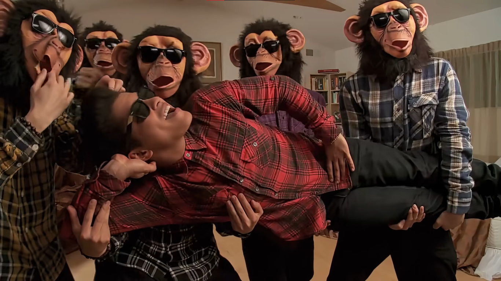

# Week 2 - Feminism

## Quote of the day

**As long as she thinks of a man, nobody objects to a woman thinking.**  - *Virginia Woolf, author*

Virginia Woolf refers to the fact that in the heart of today's society, a woman will not be able to do otherwise than think or link her life to man. She refers to the fact that man is the main element of society and nothing can happen without it.

 

## "Gender consideration" part 2 (After Perk of the job):  What is feminism or what should it be according to you?

For me, I believe that feminism does not exist.

I am aware of it and I totally understand the movement but I find the name given unjustified. Feminism advocates **the equality of men and women**, nothing more, nothing less. To designate someone as a feminist is to designate someone who is looking for equality between men and women, so I think the term is misused. For example, today a person wanting equality between a black person and a white person is someone considered normal, the opposite would be a racist. I consider gender equality in a similar way. A person seeking gender equality should not be a feminist, but rather a normal person. And so femisimne should be a normality and not a movement.

The Bechdel test is a test aimed at films or video to know if yes or no, women will be concerned in the film. To do this it seeks to verify 3 rules :

- Two female characters
- Who talk to each other
- about something else than a man

I don't think you can use this test to have a more feminist or non-feminist approach in a film. I consider that it is very good as a stastistic but not further. To check if a film passes the test or not would logically push to modify some elements of the film in order to validate this test, and here, the result would be anything but feminist. In comparison, it would be to say "This character will be black because we need a black person in the movie so that it doesn't look racist", no, it's the opposite. Every choice of character should be justified or not according to the story and the character that has to be played, not only because of the gender of the person.

So I don't consider the interest of setting up a test, whether it's this one or a new one for the creation of a new movie, but I still think that they are very interesting for statistics.

 

# Week 1 - Weird but fun

## Quote of the day

**Inside every cynical person, there is a disappointed idealist.** - *George Carlin , Comedian*

Every person who has chosen to break out of the societal codes has been deeply disappointed by something, whether it is due to society, an element that they cannot control and that they cannot change at their own level (like climate, economic functioning, etc.) or due to personal events, to encounters that have taken place in their lives.

 

## Musical Interlude

**The lazy song** - *Bruno Mars*

I did this exercise in intermediate. Sometimes I had a little difficulties so I didn't try a more complicated level.

 

## Storytelling Part 1 : Uncharted territory for some- Stand-up comedy in English

I chose for this exercise the sketch **Robin Williams - Alcoholism**. Here as its name indicates it, he tries to highlight the behavior and the problems of alcohol. To do this, he tells a story by including himself in it, he will describe himself as an alcoholic and therefore tell banalities as if it were his experience. He will follow a guideline while quickly rambling on many different anectodes and playing the characters of these anectodes. His humor works very well on me because his jokes are always completely unexpected and well acted. 