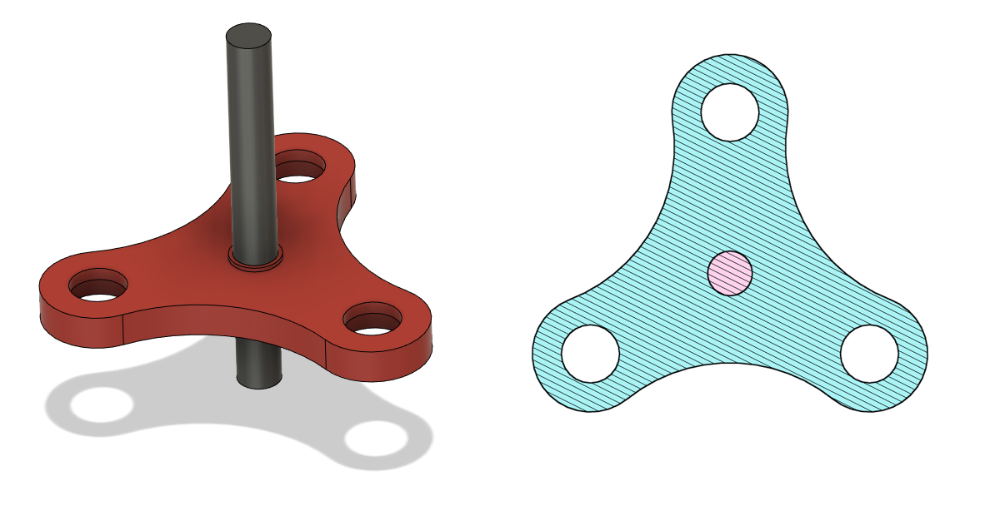
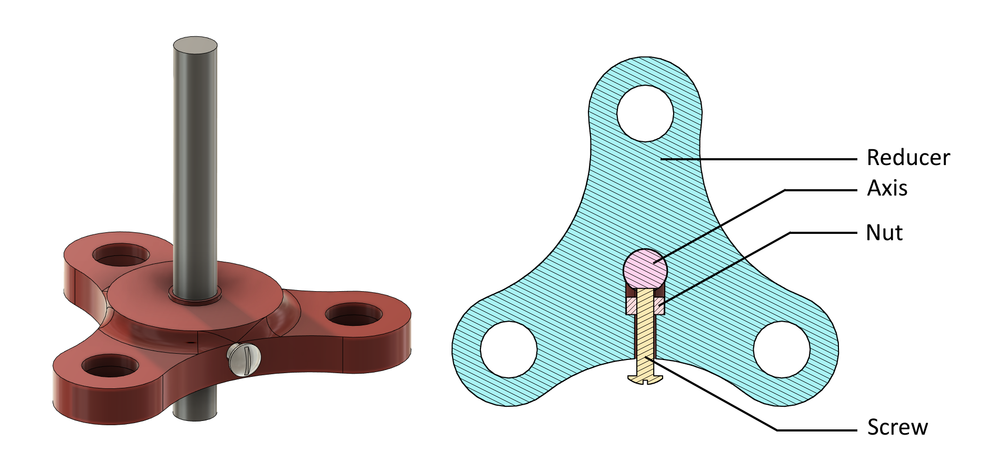
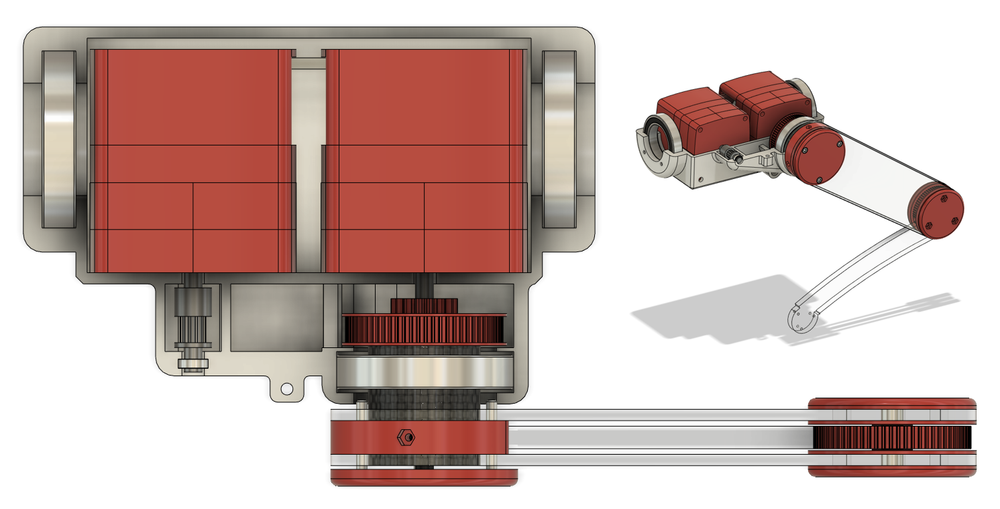
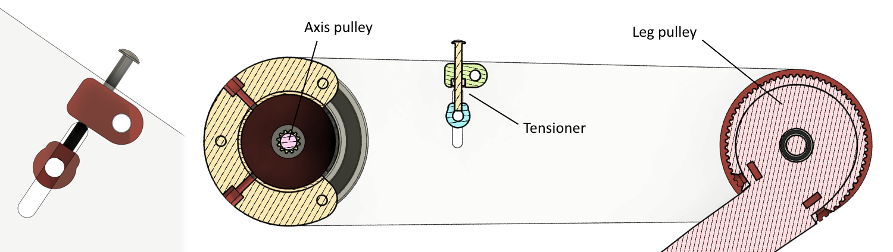
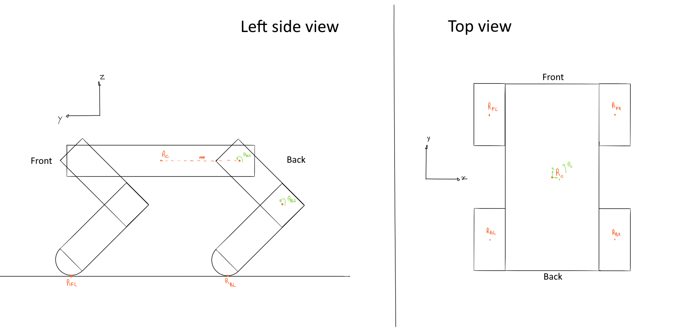
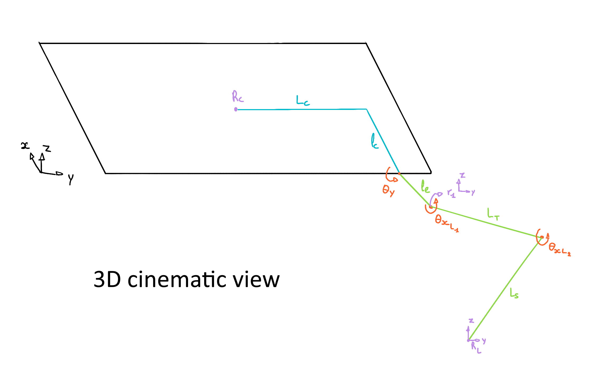
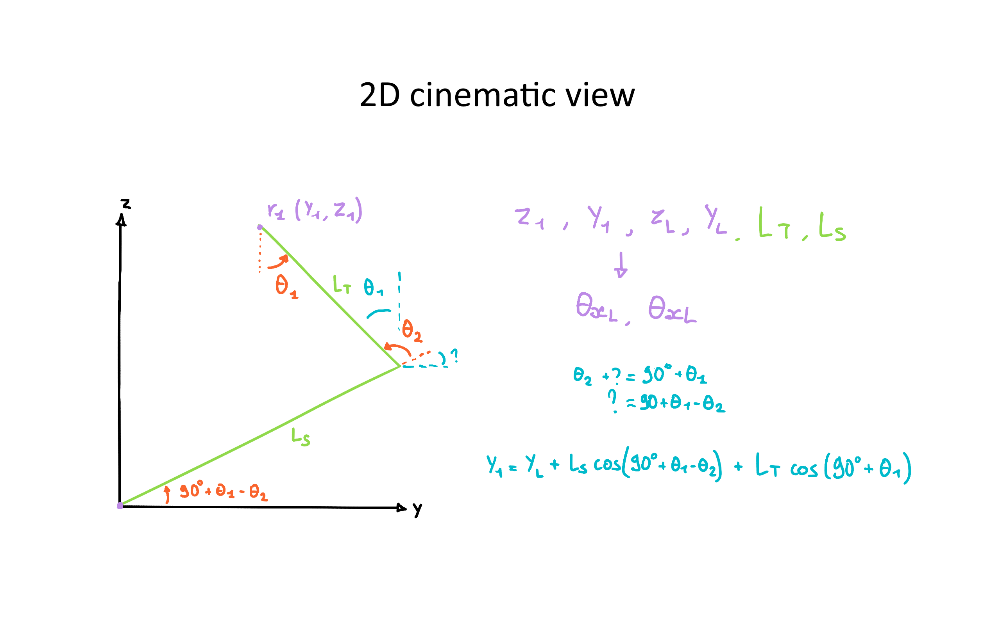
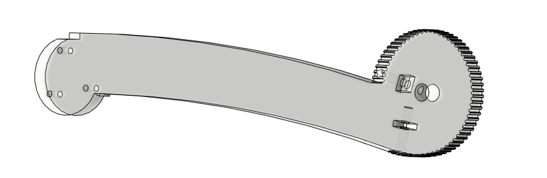
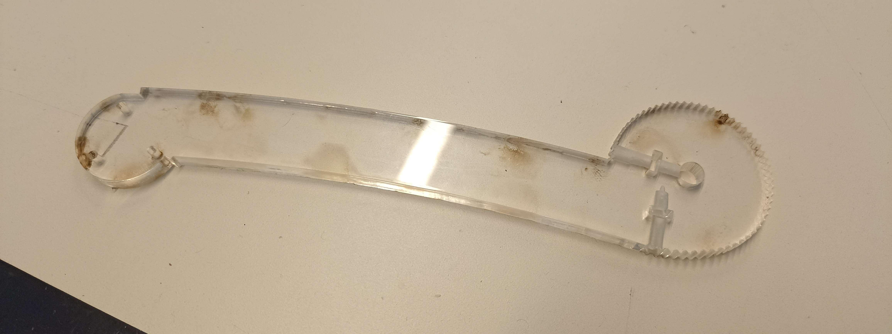
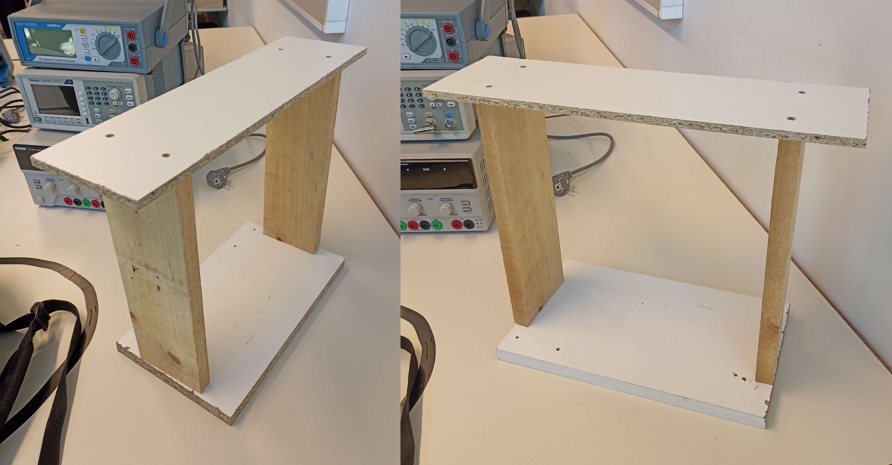

# Week 41 - October 14, 2022 - 7h

## **Component change**

During the design of the leg I realized a problem, **the rotary life** of [the potentiometers we had chosen](https://fr.aliexpress.com/item/32996236826.html?spm=a2g0o.detail.1000060.3.2dfd75067cm24G&gps-id=pcDetailBottomMoreThisSeller&scm=1007.13339.291025.0&scm_id=1007.13339.291025.0&scm-url=1007.13339.291025.0&pvid=aa5bbdd6-37f4-4697-8922-a5d47906774f&_t=gps-i). They had a rotary life about **100 cycles** which is not enough. So we chose to start on [new potentiometers](https://fr.aliexpress.com/item/1005002766893077.html?spm=a2g0o.detail.1000014.28.6d93d6c1fPOoi0&gps-id=pcDetailBottomMoreOtherSeller&scm=1007.40050.281175.0&scm_id=1007.40050.281175.0&scm-url=1007.40050.281175.0&pvid=c4eb49e9-017c-42e1-bc5a-36d0b91caa96&_t=gps-id:pcDetailBottomMoreOtherSeller,scm-url:1007.40050.281175.0,pvid:c4eb49e9-017c-42e1-bc5a-36d0b91caa96,tpp_buckets:668%232846%238116%232002&pdp_ext_f=%7B%22sku_id%22%3A%2212000022084500624%22%2C%22sceneId%22%3A%2230050%22%7D&pdp_npi=2%40dis%21EUR%210.42%210.37%21%21%21%21%21%402101f6b416658300092574280e1af7%2112000022084500624%21rec) with a rotary life about **10,000 cycles** which will be much more resistant.

So I updated the list of components available [here](https://github.com/RonanLc/Snoopytech/blob/main/doc/Rapports/Liste%20de%20composants.xlsx).

## **Important and modeling of default components**

After Maximilien created [a common project on Fusion 360](https://myetu3651.autodesk360.com/g/projects/20221014567544581/data/dXJuOmFkc2sud2lwcHJvZDpmcy5mb2xkZXI6Y28uNXprUVZwQ0VTM3VlQ1hmSjdNN09nQQ), I imported and modeled the components we will use like an Arduino Uno, a Nvidia JN30D and others. This will allow us to have accurate references for our modeling.


## **Research on leg transmission**

We were not yet decided on the transmission used for the legs of the robot. So I took the time to break down the possibilities to choose the best one.


I have therefore determined **3 possible transmissions** :

- **A.** With a connecting rod
- **B.** With a belt
- **C.** With a worm screw

Given the reliability and complexity of these transmissions, we have chosen to use the **B. transmission, with a belt**. It seems to be the most feasible and aesthetic. It will also allow us to use it directly as a gearbox.

## **Leg design**

So I started to think about the precise design of the leg and I chose to make it like the following sketch.


So I started to model the leg but I haven't finished yet because of lack of time.

I modeled the shoulder tube used to rotate the leg. It is made of carbon so I entered its density (1.79g/cm3) in Fusion 360 to estimate the weight at the end.

I also modeled the ball bearing that will connect the leg to the shoulder.


## **Next week**

I will concentrate next week on the modeling of the leg and its assembly with the different components.

My goal is to finish modeling the leg at the end of the next session. For that I still need to design the most solid and light solution of the leg.

Once that is done, I can start modeling the shoulder and then the junction with the rest of the body.

# Week 42 - October 18, 2022 - 17h

I focused this week on the robot leg. I looked at its design, its performance and how can I build something strong and light.

## **Leg schematic**

I realized that most of the existing robots were still designed in a similar way.


They all have a straight thigh and then a curved tibia so I decided to base the leg on that.

The thigh and the shin being generally of the same size, I decided to make the thigh and the shin of 15cm. This will allow us to make the robot go up to 30cm high in case we have to overcome big obstacles. This will also be more than enough to climb the steps.

## **Modeling of the leg**

As indicated in our report, I designed the thigh and the tibia so that they can be cut out of plexiglass. This will allow us to quickly change these parts if there is a problem because they are parts that will undergo strong constraints.


I then modeled the knee joint, then the hip joint. I decided to use mainly 3D printing to design the parts that hold the bearings.


The joints are almost finished. I have set up the materials of each part to have an idea of the weight of our future legs.


So now we have the look and design that our leg will have, this gives us an idea of the visual that our robot will have and also the weight and capabilities.


## **Next week**

The joints are now almost finished so I'm going to focus on modeling the transmissions and the motorization next week.

The next step will also be to design the shoulder which will contain the motors and the position sensors. Then to focus on the connection with the body. This will allow us to start the complete assembly of the robot and correct the different errors before starting the production.

# Week 43 - October 28, 2022 - 22h

## Shoulder preliminary conception 

The leg was finish so I start working about the motor part and mostly **the shoulder part**. I made a lot of sketching because this part is the **most complex** of the leg build.

The shoulder must fit a lot of part in it :
- The 2 motors of the legs
- The belt of the hip speed reduction
- The 2 potentiometers to check the knee and hip position
- A cable connector to power all the leg part
- The pullet for the shoulder rotation

The difficulty here is to fit every thing in the shoulder. But the shoulder must be very **compact, light and also have a good design.**

## Shoulder modeling

I decided to made the shoulder in **2 part**, one for the top and one for the bottom. These parts will be made with a **3D printer**.

So I start to modeling the part to fix the shoulder on the frame. I decided to made an other tube, around the carbon fiber tube with 2 bearings.


After that I had to modeling someting to fix the 2 motors. I didn't want to fix the motors directly on 3D parts because it's not precise and solid enough.

So i decided to fix the motors on a **plexiglass piece**.

For that I modeled **a gutter** that can accommodate the plexiglass plate. So the 2 3D parts will close on the plexiglass piece.


The bottom part isn't finish yet but I start a assembly of the shoulder. I had the bottom and the top part, and the 2 bearing.


## Next week

During the next I'll continue the shoulder part.

Now I need to focus on the motors fixation and the transmission part. When the transmission will be done, I'll fix the shoulder to the rest of the leg.


# Week 46 - November 15, 2022 - 26h

## Receiving and adding 3D parts

We have received some parts that we ordered. This will allow us to start the construction of the robot but first to finalize its 3D design.

We received the 30mm bearings, the belts, the pulleys of belts, a part of the ESC. So we have all these components:


*Green: components received / Blue: components waiting / Red: components without information*

So I was able to model some parts like the belt pulley.


## Shoulder modeling

I continued the modeling of the shoulder of the robot. I modeled the plexiglass plate that will hold the motors. It will slide between the upper and lower part of the shoulder.

So I could add the motors to the assembly and continue to model the shoulder shells to enclose them.


## Shoulder and leg assembly

With the motors added, I was able to continue modeling the shoulder and then assemble the leg to the rest of the assembly.

I added links to connect the angular displacement of the legs and the motors. But the reduction is still to be determined.


## Next week

I will focus on the attachment of the leg to the shoulder. The system must be reliable and strong. 

I will also add to the shoulder the mechanism with the potentiometers to measure the position of the legs.

Depending on the progress, we will be able to start building the robot at the end of the session.

# Week 47 - November 25, 2022 - 30h

We received the last components at the beginning of the session so I focused my session on working on the motors.


*Green: components received / Blue: components waiting / Red: components without information*

We now have all the main components to build the robot.

<br>

## Préparations des moteurs

Before starting to use the motors, some preparation has to be done. Here we received connectors with the motors so I decided to solder them to the motors and ESCs to easily connect them.


Motors and ESCs can therefore be easily connected and disconnected.


<br>

## Electric assembly

Thanks to these connectors I could assemble the electrical system for the motors. It is composed of a motor, an esc, and an arduino board and a potentiometer to drive the motor.

the electrical circuit is composed as follows:


The LiPo battery here has been replaced by a DC voltage generator set to 15V to simulate the connection to a LiPo 4S.

The potentiometer will be used to select the speed of rotation of the motor and its orientation.

<br>

## Motor programming

Many methods exist to control the motor, or to control the esc. Here I use an arduino board and after many tests I discovered that some ESCs can be controlled the same way as a servo motor.

That is to say that it is controlled by PWM. This allows to indicate to the ESC the desired motor speed.

So I tested a very simple program using the arduino library for servo motors.

```ino
#include <servo.h>
```
The program works in a very simple way. It recovers the value that the potentiometer returns (corresponding to its position) and converts it in a proportional way to send it in pwm to the ESC.

```ino
#include <Servo.h>

Servo esc;
int pot;

const int pinPot = A0;
const int pinEsc = 5;

void setup() {
  esc.attach(pinEsc, 1000, 3000);
  Serial.begin(9600);
}

void loop() {
  pot = map(analogRead(pinPot), 0, 1023, 0, 180);
  Serial.println(pot);
  esc.write(pot);
  delay(10);
}
```

And here are the very first turns of the motor of our future robot!

[](https://youtu.be/H11FsNPKSh8)

During this test I noticed two things. First, the motor doesn't seem to be going at its maximum speed so the pulse durations of the pwm would have to be changed. Second, the PWM is also used to change the direction of rotation of the motor.

The next command allows to choose the orientation of the servo motor normally. It supports an input from 0 to 180.

```ino
esc.write(90);
```

From ``90`` to ``0`` the motor turns in one direction.

*0 is supposed to be the maximum speed of the motor.*

<br>

And from ``90`` to ``180`` the motor turns in the other direction.

*180 being supposed to be the maximum speed of the motor.*

<br>

## Next week

We will start building the robot. The conception is almost finished which will allow to do the first tests of the legs in the next sessions.

The library for the servo motor works well but it is not optimized for brushless motors, at least not for this ESC.

So I'll be interested in the programming of the motor and find codes to exploit 100% the possibilities of the motor. I will also try to drive several motors at the same time.

<br>

# Week 49 - December 6, 2022 - 44h

Before starting to assemble the motor with the legs we had to know if our motors are well sized for our robot.

<br>

## Motor power

To know if our motors will be powerful enough we want to know their speed and torque.

To do this we can ask these different variables :

```
N : Motor rotation speed (in rpm).

U : Electrical supply voltage of the motor

I : Current flowing through the motor

Ri : Real internal resistance of the motor

Io : No-load current

Kv : Speed constant of the motor (here we use a 320kv motor)

Pe : Electrical power of the motor

Pj : Joule effect losses

Po : Internal friction losses

Ps : Motor output power

C : Mechanical torque at motor output
```

<br>

First of all let's calculate the torque. To do this we will calculate it thanks to the power of the motor. Several characteristics apply to electric motors and brushless motors are no exception. Here are their respective formulas :

<br>

Motor speed : 
$$ \text{N = Kv} \times \text{(U - I} \times \text{Ri)} $$ 

Electrical power consumption :
$$ \text{Pe = U} \times \text{I} $$

Joule effect loss :
$$ \text{Pj = I2} \times \text{Ri} $$

Internal friction losses :
$$ \text{Po = (U - I} \times \text{Ri)} \times \text{Io} $$

<br>

We can therefore calculate the power output of the motor with the losses.

$$ \text{Ps = Pe - Pj - Po} $$

$$ \Leftrightarrow \text{Ps = U} \times \text{I - I2} \times \text{Ri - (U - I} \times \text{Ri)} \times \text{Io} $$

$$ \Leftrightarrow \text{Ps = (U - I} \times \text{Ri)} \times \text{(I - Io)} $$

We also know that the output power is :
$$ \text{Ps = N} \times \text{C} $$

<br>

We can therefore write the equality linking the torque to the electrical characteristics of the motor.

$$ \Leftrightarrow \text{N} \times \text{C = (U - I} \times \text{Ri)} \times \text{(I - Io)} $$

$$ \Leftrightarrow \text{N} \times \text{C = } \frac{N}{Kv} \times \text{(I - Io)} $$

$$ \Leftrightarrow \text{C = } \frac{(I - Io)}{Kv} $$

<br>

From the constructed information we deduced that we could estimate ``(I - Io) = 20A``.

Which gives us:

$$ \text{C = } \frac{20A}{320kv} \text{ = 0.0625 N.m}$$

<br>

Let's focus now on the speed.

We know that on a brushless motor the speed is defined by :

$$ \text{N = U} \times \text{Kv} $$

Here we intend to use 4s batteries.

$$ \text{N = (3.7V} \times \text{4)} \times \text{320Kv = 4736 rpm} $$

<br>

So we have a motor running at ``N = 4736 rpm`` for a torque of ``0.0625 N.m``.

<br>

## Required power calculation

We now need to determine the power we will need.

In the bibliographic report we estimated that the robot would be about 4kg in total. That is 1kg per leg.

When designing the legs I chose to size them in two parts of 150mm.

$$ \text{1kg} \times \text{9.81m/} s^2 \times \text{0.3m = 1.4715 N.m} $$

This means that the robot will have to support a torque of ``1.4715 N.m`` to be able to stand up when the legs are positioned as follows.


<br>

## Reducing calculation

Now we have to determine the gearbox we will need.

To do this I relied on the speed of rotation.

<br>

I estimated that our leg should move at a maximum speed of 1.5 rps. This will give us good mobility and responsiveness.

$$ \text{1.5 rps = 90 rpm} $$

$$ \frac{4736 rpm}{90 rpm} \simeq \text{52.6} $$

So I estimate that I need a gearbox of about 1/50 to fully utilize the capacity of the motors.

<br>

Knowing the torque of the motor, we can therefore estimate the torque applied to the shaft of the legs.

$$ \text{0.0625 N.m} \times \text{50 = 3.125 N.m} $$

Knowing that we needed ``1.4715 N.m``, the robot will have the power to carry more than twice its weight and thus have a significant payload.

<br>

## Reducing agent used

Several possibilities are available for the reducers.

### Buy our reducers

The first one was to buy steel ones. They will be flawless and resistant, just what we need.

Unfortunately, the ones on the market are not adapted to our motors and therefore it would have complicated our task greatly. Moreover, these reducers are often very expensive and we did not want to increase the cost of our robot unnecessarily.


We have therefore chosen to design our own gearboxes.

<br>

### Making with belts

The second solution considered was to design a system with several pulleys and belts in series.

After many tests and calculations I obtained conclusive results for different designs.


*Blue : knee transmission | Green : hip transmission | Purple : Potentiometers | Black : Motors*

But I encountered a big problem with this system. We had to use closed belts because some pulleys will make more than one full turn. And unfortunately the smallest belts on the market are 120mm. This is way too big for our system. So I had to abandon the transmission with the belts.

<br>

### Making with gears

So I turned to gears which will have allowed me to solve this problem.

The problem with the gears is that the teeth and the axles are highly solicited.

And our manufacturing means are limited so we would have to make them in 3D printing and I was afraid that it would not be strong enough in time and that our system would not have any play.

So I abandoned the idea.

<br>

### Manufacture epicyclic gears

At least not totally. After some research on the internet I discovered the existence of epicyclic gearboxes (or planetary gearboxes).


This system works with gears but the system is perfectly balanced. It is known to be more resistant, to have less play but especially, to be able to pass more torque than with simple gears.

So I chose to use this system.

<br>

## Next session

I will focus on the sizing of the gearbox and its design.

<br>

# Week 49 - December 9, 2022 - 59h

## Gearbox sizing

I had several constraints to determine how I was going to make the gearbox.

The first one was the maximum size of the large pinion. I didn't want to go more than 50mm over the diameter (stator size of the motor) to not have too big parts in the shoulder.

I chose to use a 1.2 pitch for the gears. This means that here I would use an external pinion of 40 teeth:

$$ \text{40} \times \text{1.2 = 48mm} $$

And my second constraint was the size of the pinion connected to the motor. To be able to aim it on the rotor without worries, I needed a pinion of more than 18mm. So I chose to use a 20 teeth pinion.

$$ \text{20} \times \text{1.2 = 24mm} $$

An epicyclic gear is composed of 4 different parts. 

- The central pinion (Red) named ``P`` for the continuation
- The crown gear (Green) named ``C`` for the continuation
- The satellites (Yellow) named ``S`` for the continuation
- The satellite holder (Cyan)

In view of my constraints I decided to divide the gearbox in 3 parts. I will put in series 2 epicycloidal trains (R1 & R2) then a gearbox with a belt (R3).

<br>

After reading up on epicyclic gears, I discovered that there are several rules to follow when determining which pinion sizes to use.

- Reduction ratio for the fixed gear :

$$ \frac{Zp}{Zp + Zc} $$

- Number of teeth of the parts :

$$ \text{Zc = Zp + 2} \times \text{Zs} $$

- Number of satellites (Nbr):

$$ \frac{Zp}{Zs} \text{+ 1  = Nbr} $$

<br>

We can therefore determine the following equation :

$$ \text{R1 + R2 + R3 = Rtotal} $$

$$ \Leftrightarrow \frac{20}{20 + 40} \times \frac{x}{x + 40} \times \frac{12}{y} = \frac{1}{50} $$

<br>

Let's determine ``x`` :

$$ \text{Zc = Zp + 2} \times \text{Zs} $$

$$ \Leftrightarrow \frac{Zc - Zp}{2} \text{ = Zs} $$

$$ \Leftrightarrow \frac{Zp \times 2}{Zc - Zp} \text{+ 1 = Nbr} $$

$$ \Leftrightarrow \frac{Zc \times (Nbr -1)}{1 + Nbr} \text{ = Zp}$$

For the best stability I chose to put 3 satellites.

$$ \frac{40 \times (3 - 1)}{1 + 3} \text{ = 20}$$

This gearbox will therefore be sized like the first one.

$$ \frac{Zc - Zp}{2} \text{ = Zs} $$

$$ \frac{40 - 20}{2} \text{ = 10} $$

So we have all the sizes of the gears for the planetary gearing:

- Zc = 40 teeth
- Zp = 20 teeth
- Zs = 10 teeth

It remains now to determine the size of the pulley for the last gear (y):


$$ \frac{20}{20 + 40} \times \frac{20}{20 + 40} \times \frac{12}{y} = \frac{1}{50} $$

$$ \frac{20}{20 + 40} \times \frac{20}{20 + 40} \times 50 = \frac{y}{12} $$

$$ \frac{20}{20 + 40} \times \frac{20}{20 + 40} \times 50 \times 12 = y $$

$$ y \simeq 66 $$

The last calculation being an approximation because we cannot have a decimal number of teeth. The final reduction ratio will be :


$$ \Leftrightarrow \frac{20}{20 + 40} \times \frac{20}{20 + 40} \times \frac{12}{66} = \frac{1}{49.5} $$

But this will in no way prevent the gearbox from working properly.

<br>

## Gearbox modeling

The epicyclic gearbox is therefore composed of 13 parts shown below and 8 ball bearings.


So I put it all together to get the following setup:


These parts will be printed with an SLA printer. I felt that the uncertainty of FDM printing would not be strong enough and would have too large an area of insertitude.

So I was able to assemble the leg to these reducers. The design is not finished yet and some details are still to be modified but we can already have an idea of the general shape of the final assembly of the leg.


<br>

## Gearbox printing

My big concern about this gearbox was the feasibility. The gears must be strong enough to support the torque and the speed. The bearings must have no backlash to minimize friction. And the gears must not have any play either or the system will fail.

Since we are going to use 3D printing I was very doubtful that it would really work.

So I decided to print a few parts so I could try and learn about SLA printing.


The parts went on correctly. I had no problems with it and the accuracy of the parts surprised me. There doesn't seem to be any uncertainty like with FDM printing. I am finally very optimistic about the manufacturing of this system.

<br>

## Next week

So now I'm going to focus on building the system by running as much printing as possible and continuing to correct and modify the errors I encounter on the 3D design.

<br>

# Week 50 - December 14, 2022 - 64h

## Gearbox printing

After having completely modeled the different elements of the transmission and the gearboxes, I started to print them.

For this I had to learn how to use SLA printing. This printing is more complex than FDM printing.

It works in different steps:

### 1 - Slicing the parts

This step is necessary to prepare the printer plate and to choose the printing parameters of our parts and supports.


### 2 - Printing

After the previous step we send the file to the printer. We set the printer to the right resin and then we start printing.

SLA printing is faster than FDM printing. Here for a complete plate I had 1h30.


### 3 - Cleaning

For the parts printed in resin it is necessary to clean them, to remove the resin still liquid on the parts.

To do this we bathe them in a vat of alcohol. Here I used Draft V2 resin so I immersed the parts for 10min.

### 4 - Curing

The last step is to harden the parts. When they come out of the printer, the resin is still a bit soft and the parts remain malleable. Once they are well cleaned, we expose them to strong UV rays for 5 minutes in a closed chamber.

After this step the parts are finished.

<br>

## Problems encountered

During this first printing I encountered several problems.

### Printing uncertainty

Every 3D print has an uncertainty and I couldn't find on the internet the one for the SLA print.

During the first print I did last week I had a 4.9mm axis for a 5mm bearing and it turns out that there was, I think, a lot of play. So I felt that 1mm was way too much.

So I tried to remove all the uncertainties. Make 5mm pins for 5mm bearings.

Of course it didn't work. I still managed to make the assembly but the system is almost impossible to turn and no bearings can go to the places intended for.

Blocked system](assets/session_8/blocked_system.png)

The parts of this system are completely blocked and cannot be removed.

After doing some tests I concluded that the uncertainty of the SLA print is about ``0.05mm``.

### Print media

Another problem was the print media.

Resin printing holds a lot to the platen, especially when we print flat surfaces. To remedy this, we use supports that will raise the part.

Not using a support is very efficient but the parts are very complicated to retract. To do this, you have to force them, which means you either damage the parts or injure yourself.


The problem is that the result with and without supports is completely different. With supports the print is not flat and creates a surplus of material on the surface.


*Here on the left **with** / on the right **without***

The piece on the left has been sanded. We tried to correct this error by sanding the pieces with Maximilien.

[](https://www.youtube.com/shorts/yaIJI3Ak4zo)

But the results were not very convincing. The parts remain inaccurate and we lose a lot of time during the manufacturing process to sand each part. We will have to continue printing without supports.

## Next session

I will continue to print the reducers but this time by correcting the uncertainties.

<br>

# Week 50 - December 16, 2022 - 72h

## Gearbox printing

So I changed the uncertainty of the parts and I reprinted them. This time I did not have any problem during the printing and the system is correctly mounted.


I still have some corrections to make because the box doesn't close due to offsets (like on the picture on the left).

The gears are white because of the friction between the parts, the parts wear while turning and the resin tends to whiten very quickly. But the parts are still efficient before turning.

The friction is still a problem, despite the reduced tolerance. The motor still manages to turn the parts easily but it would be better to apply **grease** to the final assembly.

After discussing with a teacher we also concluded that we could use sheets of **teflon** under the gears to limit the friction with the fixed parts.

Limiting this friction would in first, **limit the wear of the parts** and in second, **limit the heating of the system**.

We were still able to install the bearings in the parts.


<br>

## Tests
We have verified that the reduction ratio is indeed 1/3 for one stage and we could test to make the motor turn with the reducer.

[](https://youtu.be/gItiiFNIVas)

The reducer makes a lot of noise due to the gear play and the noise of the plastic but this should be manageable with some grease.

<br>

## Next session

So I will continue to work on the reducers and the goal of the next session will be to have a finished reducer of the right size to be able to print several of them.

<br>

# Week 3 - January 16, 2023 - 106h

## Modification of the gearbox

The gearboxes have been completely modified.

I changed a lot of insertitude to have a functional system and to do some tests. There is now some play between the gears but it is a play that we can correct as we go along.

The whole gearbox has also been printed in PLA instead of resin. The goal was to print a gearbox as quickly as possible and therefore not to bother with the resin.

The fixations of the gearbox have also changed. Instead of having two small screws holding the whole thing I installed 4 M4 screws on both sides to hold it firmly.


<br>

## Prototype of a leg

For the presentation of Monday January 16th we wanted to present a functional paw. Due to lack of time I focused on one joint, the knee. So I made a prototype of the paw by modifying some parts to make only the knee move.

The reducer was fixed to the hip as if below.


<br>

## Transmission

The gearbox is not the only part of the transmission and speed reduction. There is another reducer thanks to a belt. Here for the knee, this reduction is done between the two plates of the leg corresponding to the thigh.

A steel pulley of 12 teeth is connected to the axis of the reducer. Then, another pulley of 66 teeth is connected to the part of the leg corresponding to the tibia.

I installed a belt between the two to connect them. This belt is not closed, its end is aimed at the tibia, it goes around the pulley of 12 teeth and then returns to screw in the tibia.

The tibia has therefore been modified to make room for the belt. The axis of the tibia is no longer aligned with the axis of rotation of the knee.


<br>

## Construction

All the pieces were cut and assembled.

You can find some videos here below.

[Testing the PLA planetary gearbox](https://youtu.be/Rsbbrvysg-4)

[Installation of the knee belt](https://youtu.be/3-rBXzxxJk4)

[How the gearbox works](https://youtu.be/zriuFQDhgsk)

The knee could be correctly assembled and we could make the tests of the functioning. It moved corrector in both directions.

The test can be seen [here](https://youtu.be/JdPR6T-Bgfs).

I purposely left the sound on to hear the reducer. It is very noisy, this is due to the play between the gears and also to the fact that I have not yet put any grease or oil to lubricate the gearbox. This will be added later.

## Next

It remains now to build the rest of the leg, the hip joint. Then to correct as much as possible the play in the reducer.

<br>

# Week 5 - January 31, 2023 - 114h

## Modification of the gearboxes

A first problem on the reducers was encountered during the first tests : the paste did not always follow the movement of the motor. It was getting out of sync with the gearbox.

And there is a simple reason, the steel shaft controlling the belt was slipping in the gearbox.



As shown on the picture, the axle was only sliding in the part that was supposed to drive the movement of the lug and so it was sliding when the system was asking for the least torque.

I changed this so that the two parts stay well linked during the movements.

I simply cut a flat on the axis and added a nut with a screw inside the part.



After retesting, this solution solved the problems of slippage and play. The system is now solid and resists high torque.

<br>


## Resizing of parts

The previously modified part is at the heart of the reducer. Since it has been enlarged to accommodate the life in its thickness. I had to modify all the other parts of the system so that it doesn't create an offset.

I also modified the shoulder modeled by Maximilien so that it could match the new dimensions of the reducers.



<br>


## Problem with the belts

We encountered a problem during the new tests. When we apply a high torque to the system the belt jumps and does not transmit the motion.

We discovered that the reason was that the belt was not tight enough. The belt is connected with screws on both ends. It was difficult to tighten it when we aimed the screws.

So I added a system on the thigh of the robot allowing to tension the belt with a screw.




The lower part of the tensioner will come against the belt and therefore will tension it. We can adjust the tension with the screw (in yellow on the schematic) then a screw passing through the hole of the blue part will lock the position of the tensioner.

The system is a first version and may need to be improved. It is possible that the friction of the tensioner with the belt due to the tension is too high. In this case it will be necessary to install a bearing.

<br>


## Next

We still have to add the potentiometers on the joints. Then we will be able to print the whole robot.

<br>


# Week 6 - February 7, 2023 - 122h

## Installation of the potentiometers

We now had to install the potentiometers within the system to be able to have a feedback on the position of the joints.

The main difficulties were to design simple, reliable systems with as little change as possible in the design of the robot.

Maximilien Kulbicki took care of the hip joint and I took care of the knee and shoulder joints.

### **1 - The knee**

For the knee, I dismantled the potentiometers to keep only two pieces. This allowed to save a lot of space because the potentiometers were very imposing.

The two parts are a fixed part, having the tracks (the brown part) and a mobile part making the contact between these tracks (the white part).


So I used the steel axis of the joint. This one will be fixed to the tibia and will turn if we move this joint. I fixed the mobile part to it.

And with the help of a 3D printed part I could connect the fixed part to the thigh. These two parts will vary according to the movement and we can know the position.

To connect the axle to the mobile part, I wanted to drill the axle in its length and come to tarod it. Because of the lack of material, the operation seemed complicated. Pascal Masson helped me to find a solution and succeeded in cutting the axis so that it could be assembled directly.


### **2 - The soulder**

For the shoulder I used the same two pieces of the potentiometer. I positioned the mobile part on the shoulder shell and the fixed part on the frame.


The mobile part will be through a carbon tube that will be fixed to the bearing of the shoulder shell.

The fixed part will be attached to a 3D printed part that will be fixed inside the carbon tube.

<br>


## Assemblage de l'épaule

After finishing the potentiometers and correcting the last errors. We were able to start prototyping a leg.

I printed a version of the shell in a beautiful color and assembled the different components inside.


The parts fit together perfectly and the system has very little play for the moment.

It remains however to print a gearbox and re-cut the steel axes of the system.

<br>


## Next

The goal is to have a prototype of leg before the next vacations. I think it's possible.

We only have to print a gearbox, cut the steel axles, then make the final assembly with the belts.

<br>

# Week 7 - February 14, 2023 - 128h

## Printing the reducer

We were missing a reducer to finish the leg, so I printed it in PLA and assembled it.

Some parts had a printing problem so I had to go back twice.

We had enough bearings to make two so the gearbox was almost complete, it just lacked the steel shaft for the output rotation.


<br>

## the assembly of the knee

The knee is composed of two main parts:

- one that we will consider fixed here, it is composed of the two plates of the thighs, the external protections and the potentiometer.


- the second one which is mobile, it is composed of the tibia, the steel axis and the second part of the potentiometer.


I had to re-cut the plexiglass plate of the second part. I also had to find a solution to fix the steel axis to the plexiglass plate.

So I chose to use the same technique used in [the reducers](https://github.com/RonanLc/Snoopytech/blob/main/doc/Rapports/Reports%20-%20Ronan%20Le%20Corronc/Session_11.md). I drilled the plate in its length and came to screw in a screw pressing on the rod.


I also soldered 3 wires on the potentiometer to allow to get the position of the potentiometer.

We tested the values it returns but we have a problem with it, it only works on a certain range then returns 0 afterwards. I suspect that the potentiometer track was scratched during disassembly or assembly. We will have to correct this problem.

The leg is fully assembled and fits perfectly with the shoulder.

Maximilien took care of re-cutting the axles for the reducers and so we will be able to connect all the systems together with the belts.


<br>


## Next

The goal is now to make the first tests of movement with the leg and torque tests.

After that we will be able to focus on the position control of the leg and the production of the 3 other legs!

<br>


# Week 9 - February 28, 2023 - 132h

During this session I decided to start working on the math to direct the robot.

When the legs are finished, the goal is to make the robot move. Unfortunately, pre-recording movements like walking or turning is not enough. Based on this alone the robot will not be able to adapt to uneven terrain or changing loads. It must be able to find its own balance and adapt to any situation.

So I try to determine different benchmarks on the robot and the equations allowing to go from one benchmark to another.

## Definition of the benchmarks

I have defined 5 different marks on the robot.

- Rc : The reference centered in the middle of the robot, the one of the building
- Rfl : The marker at the end of the left front foot
- Rfr : The mark at the end of the right front foot
- Rbl : The marker at the end of the left rear foot
- Rbr : The mark at the end of the right rear foot

I drew plans of the robot to locate them in space. The markers are thus placed as follows:



This will allow us to determine rotations and movements in space, according to the benchmarks.

<br>

## Kinematic study

I have redrawn the robot in three dimensions to be able to determine the mathematical equations that will be useful to move the robot.

I defined different names of axes and rotation as shown in the diagram.



To simplify the calculations I started by studying the tibia and the thigh. So the axis of rotation of the knee and the hip. This allows us to start the calculations in 2D like the following diagram:



The goal was to move from the R1 to the RL positions. Unfortunately I did not manage to have conclusive results for the moment.

<br>

## Next

So I will focus on the mathematics to help find the equations to change the benchmark.

<br>


# Week 10 - March 7, 2023 - 136h

## Communication in Nvidia Jeston nano and Arduino UNO

The goal here is to be able to communicate between the two boards. 

The Arduino board will be used as a low level board, it will apply the commands of the Nvidia and will control the different sensors and motors.
The Nvidia card will be used to perform all the calculations and data analysis to determine the movements of the robot.

The two cards must be able to communicate with each other without stopping.


<br>


## Wiring

The wiring is quite simple, you just have to connect the RX of the arduino to the TX of the Nvidia. Then connect the RX of the Nvidia to the TX of the arduino.

But when I looked a little bit more closely, I noticed a problem. The serial communication of the Nvidia works in 3.3V unlike the arduino which works in 5V. In the direction Nvidia -> Arduino, this is not a problem, the arduino will be able to read the bits received in 3.3V. But in the opposite direction you have to lower the voltage, the 5V can damage the Nvidia card.

I thought at first to use only a voltage divider bridge. But according to my research, it works very well at low frequency, but by increasing the communication speed, we risk to lose a lot of bits.

The solution was to add a level shifter, a small component designed for this use allowing to communicate with two different voltages.

So the wiring is like this:


<br>


## Programming

The code is composed of two scripts, one in C that is run on the arduino and one in Python run on the Nvidia.

The ``Python`` code is as follows:

```Arduino
void setup(){
  Serial.begin(115200);
  while(!Serial){;}
}

const char stopPoint = '|';

void loop(){

  if (Serial.available()>0) {

    String commandFromJetson = Serial.readStringUntil(stopPoint);

    String ackMsg = "Message :" + commandFromJetson;

    Serial.print(ackMsg);
  }
  
  delay(500);
}
```

Here the code is only designed to receive a message from the serial communication and display it on the serial monitor.

The ``Python`` code is as follows:

```Python
import serial
import time

#arduino = serial.Serial('/dev/ttyAcM0', 115200, timeout=5)

arduino = serial.Serial(
port = '/dev/ttyACM0',
baudrate = 115200,
byterate = serial.EIGHTBITS,
parity = serial.PARITY_NONE,
stopbits = serial.STOPBITS_ONE,
timeout = 5,
xonxoff = False,
rtscts = False,
dsrdtr = False,
writeTimeout = 2)

while True:
    try:
        arduino.write("Command from Jetson|".encode())
        data = arduino.readline().decode()
        if data:
            print(data)
        time.sleep(1)
    except Exception as e:
        print(e)
        arduino.close()
```

This code is designed to first set the communication port and then, if everything works well, send the data to the arduino via the serial link. I use the ``serial`` library for that.

<br>


## Next

For the moment the communication works only by connecting the Arduino board in USB to the Nvidia. The Nvidia board has only one USB port which is already used for the camera, so we have to free it by using the RX/TX pins. Unfortunately the communication does not work via these ports. The problem seems to come from the port declaration in the Python script, the port used is not the right one.

So I will have to find the right port and redo some tests to have a reliable and functional communication.

<br>


# Week 11 - March 13, 2023 - 140h

During this session I concentrated on printing parts. The robot's paste being soon finished, we have to print all the parts to be able to build the three others quickly.

So I printed some parts that were already working.

## Gearbox


<br>

## ESC bed


The ESC beds are not very strong though. They bend when I hang all the ESCs on them, so I would have to modify them to fit more rigidly.

<br>

## Shoulder case


The shoulders had to be reprinted many times because a lot of movements take place inside, we encountered many conflicts.

<br>

## Next

I continue to print parts as soon as possible and modify them when necessary to finish the robot as soon as possible.

<br>


# Week 12 - March 21, 2023 - 143h

During this session I focused on the laser cut parts. I modified the tibia by removing the 3D printed part at the strap. So we have only one piece in plexiglass which is much more resistant.





I was also able to help Maximilien to make the body of the robot, so we cut the many plexiglass plates. Printed the parts allowing the assembly. And made a first assembly of the body.


<br>

# Week 13 - March 28, 2023 - 149h

During this session I focused on the kinematic study of the robot. As explained in [Report No. 14](https://github.com/RonanLc/Snoopytech/blob/main/doc/Rapports/Reports%20-%20Ronan%20Le%20Corronc/Session_14.md) we have to find the mathematical formulas allowing to pass from an orthonormal reference X Y Z to the angles of the leg.

I decided to start over because my previous calculations were underdeveloped and wrong.

## Schematics and name

For these calculations I used the following notations and diagrams:


**Mx**, **My**, **Mz** correspond to the desired X, Y, Z displacement.

<br>

## Direct equations

So I was able to determine the following equations:

$$ AB^2 = A^2 + B^2 - 2 \times A \times B \times cos(\textcolor{green}{\Theta}) $$

$$ \textcolor{red}{Mx} \text{ = L } \times \text{cos(} \textcolor{green}{\Psi} \text{) + AB } \times \text{cos(} \textcolor{green}{\Phi} \text{ - arcsin(} \frac{A \times sin(\textcolor{green}{\Theta})}{AB} \text{))} \times \text{sin(} \textcolor{green}{\Psi} \text{)} $$

$$ \textcolor{red}{My} \text{ = L } \times \text{sin(} \textcolor{green}{- \Psi} \text{) + AB } \times \text{cos(} \textcolor{green}{\Phi} \text{ - arcsin(} \frac{A \times sin(\textcolor{green}{\Theta})}{AB} \text{))} \times \text{cos(} \textcolor{green}{\Psi} \text{)} $$

$$ \textcolor{red}{Mz} \text{ = AB } \times \text{sin(} \textcolor{green}{\Phi} \text{ - arcsin(} \frac{A \times sin(\textcolor{green}{\Theta})}{AB} \text{))} $$

These equations correspond to the direct equations, they allow to obtain the X, Y, Z positions by knowing the angles of the robot legs.

## Next

I will focus on the inverse equations, the ones that allow to find the angles of the leg by knowing the X, Y, Z positions.

<br>

# Week 14 - April 4, 2023 - 155h

I determined last week the direct equations, so now I have to find the inverse equations.

To do this I based myself on the same diagrams.


## Inverse equations

So I was able to determine the following equations:


$$\textcolor{red}{ABo} = AB \times cos(\textcolor{green}{\Phi} - arcsin( \frac{A \times sin(\textcolor{green}{\Theta})}{AB} ))$$


$$ \textcolor{green}{\Theta} = arccos( \frac{A^2 + B^2 + \textcolor{red}{Mx}^2 + \textcolor{red}{ABo}^2}{2 \times \sqrt{\textcolor{red}{Mx}^2 + \textcolor{red}{ABo}^2}}) $$

$$ \textcolor{green}{\Psi} = arctan(\frac{\textcolor{red}{My}}{\textcolor{red}{Mz}}) - arcsin(\frac{L}{\sqrt{\textcolor{red}{Mz}^2 + \textcolor{red}{My}^2}}) $$


These equations correspond to the inverse equations, they allow to find the angles of the leg by knowing the X, Y, Z positions.

Unfortunately I was not able to find the Phi angle equation. I tried the other equations with numerical values and the results seem inconsistent.

## Next

I will have to re-study these equations as they seem to be incorrect.

<br>

# Week 15 - April 11, 2023 - 164h

## Construction of the robot support

In order to start our tests of the robot we had to hold it in the air. Thanks to that its legs don't touch the ground and we can make tests.

So I made a support to put it on.

I raised the robot of 40cm because at the maximum the legs are 30cm, that leaves us a margin not to touch the ground.

The robot rests on its plexiglass plate underneath. It rests on a wooden board that is the same size as its frame.

The whole support is made of wood. You can see it on the picture below



<br>

## Next

The prototype of the leg being now finished, I would dedicate myself to the production of the three other legs during the next sessions.

<br>

# Week 17 - April 25, 2023 - 174h

Our prototype leg being finished and functional, it was now time to make the 3 other legs. So I concentrated on this part.

## 3D parts printing

Each leg requires many 3D printed parts. I used my personal printer to be able to print all these parts, this allowed us to save time and productivity. So we had these parts to print:

- 2 shoulder boxes (10:22 printing time each) 
- 3 complete reducers (7h48 of printing each)
- All the parts used for the articulations of the leg (9h12 of printing)

That is to say a total, when the printing goes well, of 53h20 of printing per leg. We still had to print some extra parts because it happened that some prints failed.

<br>

## Plexiglass cutting

To save time, the legs are made of plexiglass. So we had to cut the plexiglass plates with a laser cutter.

There was a total of 12 pieces to cut, for one leg :

- 1 tibia
- 2 thighs
- 1 support plate for the motors


After cutting the tibia, I had to drill them with a dremel in their length to be able to put screws to hold the straps.


<br>

## Next

Now that we have all the parts we will concentrate on the assembly of the legs and the reducers.

<br>

# Week 18 - May 2, 2023 - 208h

During the previous session, we had printed and cut out all the necessary parts to make the 4 legs. We then assembled all these pieces to make the legs.

## Reducers

We had to assemble the 9 remaining gearboxes. I cut and machined the steel rods that will be used as the output shaft of the gearbox. I had to take the right dimensions and then cut a false flat to be able to fit it in the gearbox with a screw as explained in [Report No. 11](https://github.com/RonanLc/Snoopytech/blob/main/doc/Rapports/Reports%20-%20Ronan%20Le%20Corronc/Session_11.md).


Once this was done I had to trim the 3D printed parts. When a part is printed in 3D the first layers are more crushed according to the height of the plate. They are therefore wider and the reducer being designed to the nearest millimeter, these wider layers pose a problem during assembly. I had to cut them on each piece to assemble the gearbox correctly.

After that I was able to add the bearings in the parts with a press (not having a press available I used a large pliers). Then I installed the steel axle.

I then gave the different parts to Maximilien so that he could grease the gears and close them permanently.


<br>

## Next

We were able to assemble the legs during our personal time and then install the legs on the chassis. We were able to have a fully assembled robot to finish this project.


