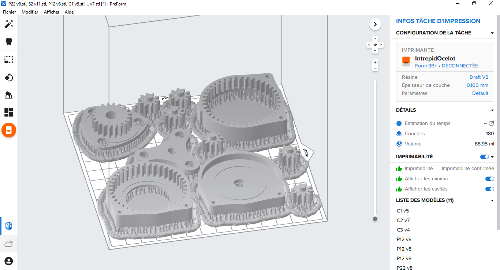

# Week 50 - December 14, 2022 - 64h

## Gearbox printing

After having completely modeled the different elements of the transmission and the gearboxes, I started to print them.

For this I had to learn how to use SLA printing. This printing is more complex than FDM printing.

It works in different steps:

### 1 - Slicing the parts

This step is necessary to prepare the printer plate and to choose the printing parameters of our parts and supports.

### 2 - Printing

After the previous step we send the file to the printer. We set the printer to the right resin and then we start printing.

SLA printing is faster than FDM printing. Here for a complete plate I had 1h30.

### 3 - Cleaning

For the parts printed in resin it is necessary to clean them, to remove the resin still liquid on the parts.

To do this we bathe them in a vat of alcohol. Here I used Draft V2 resin so I immersed the parts for 10min.

### 4 - Curing

The last step is to harden the parts. When they come out of the printer, the resin is still a bit soft and the parts remain malleable. Once they are well cleaned, we expose them to strong UV rays for 5 minutes in a closed chamber.

After this step the parts are finished.

 

## Problems encountered

During this first printing I encountered several problems.

### Printing uncertainty

Every 3D print has an uncertainty and I couldn't find on the internet the one for the SLA print.

During the first print I did last week I had a 4.9mm axis for a 5mm bearing and it turns out that there was, I think, a lot of play. So I felt that 1mm was way too much.

So I tried to remove all the uncertainties. Make 5mm pins for 5mm bearings.

Of course it didn't work. I still managed to make the assembly but the system is almost impossible to turn and no bearings can go to the places intended for.

Blocked system](assets/session_8/blocked_system.png)

The parts of this system are completely blocked and cannot be removed.

After doing some tests I concluded that the uncertainty of the SLA print is about ``0.05mm``.

### Print media

Another problem was the print media.

Resin printing holds a lot to the platen, especially when we print flat surfaces. To remedy this, we use supports that will raise the part.

Not using a support is very efficient but the parts are very complicated to retract. To do this, you have to force them, which means you either damage the parts or injure yourself.

The problem is that the result with and without supports is completely different. With supports the print is not flat and creates a surplus of material on the surface.

*Here on the left **with** / on the right **without***

The piece on the left has been sanded. We tried to correct this error by sanding the pieces with Maximilien.

But the results were not very convincing. The parts remain inaccurate and we lose a lot of time during the manufacturing process to sand each part. We will have to continue printing without supports.

# Next session

I will continue to print the reducers but this time by correcting the uncertainties.