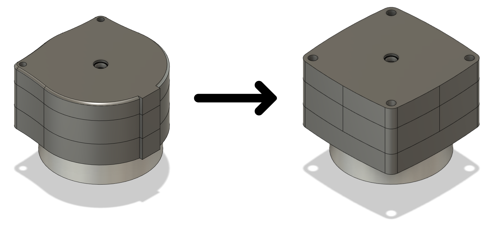
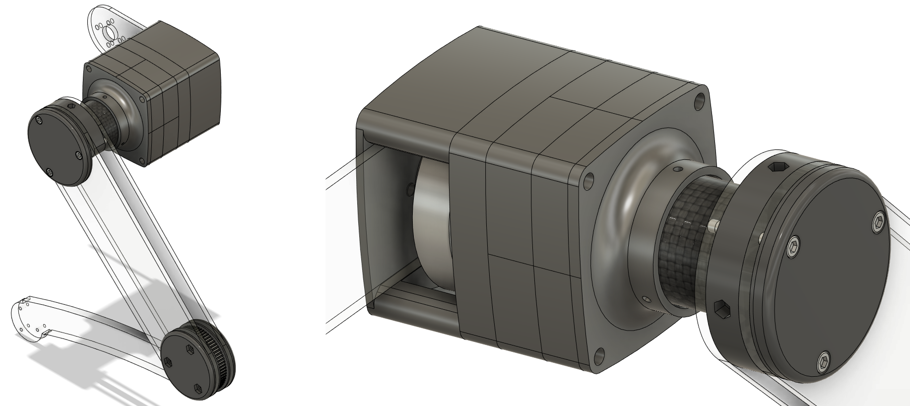
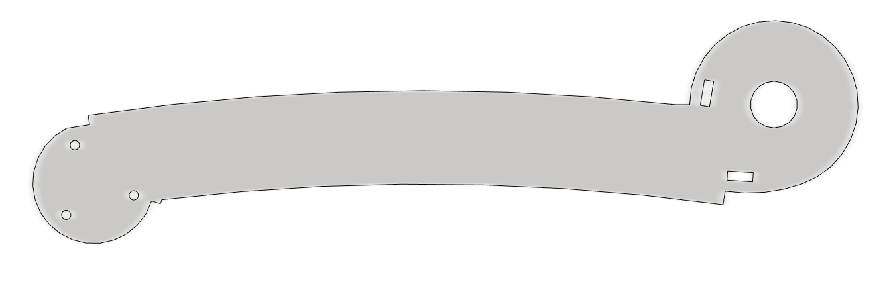
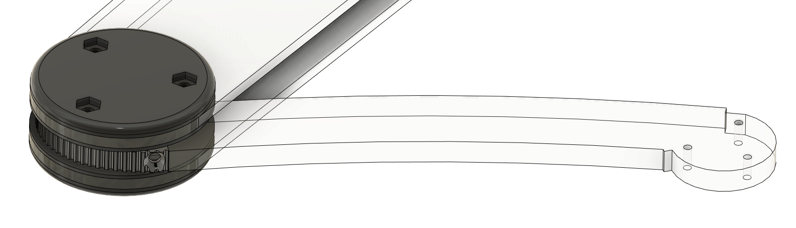

# Week 3 - January 16, 2023 - 106h

## Modification of the gearbox

The gearboxes have been completely modified.

I changed a lot of insertitude to have a functional system and to do some tests. There is now some play between the gears but it is a play that we can correct as we go along.

The whole gearbox has also been printed in PLA instead of resin. The goal was to print a gearbox as quickly as possible and therefore not to bother with the resin.

The fixations of the gearbox have also changed. Instead of having two small screws holding the whole thing I installed 4 M4 screws on both sides to hold it firmly.

 

## Prototype of a leg

For the presentation of Monday January 16th we wanted to present a functional paw. Due to lack of time I focused on one joint, the knee. So I made a prototype of the paw by modifying some parts to make only the knee move.

The reducer was fixed to the hip as if below.

 

## Transmission

The gearbox is not the only part of the transmission and speed reduction. There is another reducer thanks to a belt. Here for the knee, this reduction is done between the two plates of the leg corresponding to the thigh.

A steel pulley of 12 teeth is connected to the axis of the reducer. Then, another pulley of 66 teeth is connected to the part of the leg corresponding to the tibia.

I installed a belt between the two to connect them. This belt is not closed, its end is aimed at the tibia, it goes around the pulley of 12 teeth and then returns to screw in the tibia.

The tibia has therefore been modified to make room for the belt. The axis of the tibia is no longer aligned with the axis of rotation of the knee.

 

## Construction

All the pieces were cut and assembled.

You can find some videos here below.

[Testing the PLA planetary gearbox](https://youtu.be/Rsbbrvysg-4)

[Installation of the knee belt](https://youtu.be/3-rBXzxxJk4)

[How the gearbox works](https://youtu.be/zriuFQDhgsk)

The knee could be correctly assembled and we could make the tests of the functioning. It moved corrector in both directions.

The test can be seen [here](https://youtu.be/JdPR6T-Bgfs).

I purposely left the sound on to hear the reducer. It is very noisy, this is due to the play between the gears and also to the fact that I have not yet put any grease or oil to lubricate the gearbox. This will be added later.

## Next

It remains now to build the rest of the leg, the hip joint. Then to correct as much as possible the play in the reducer.

 