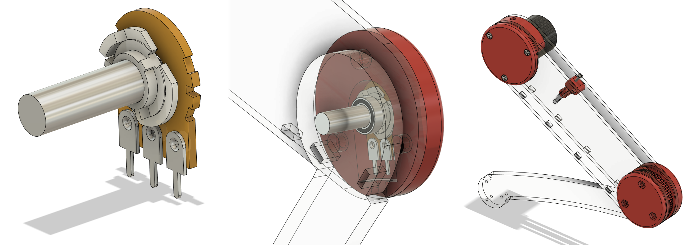
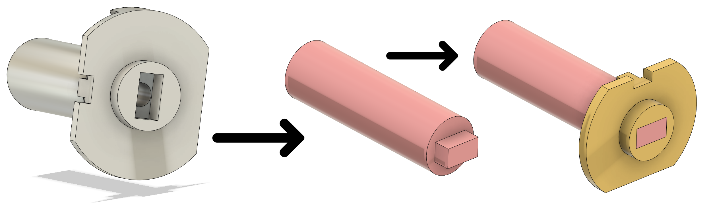
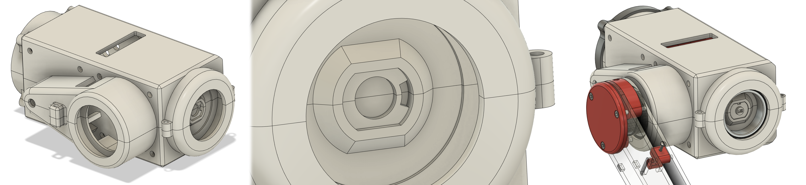
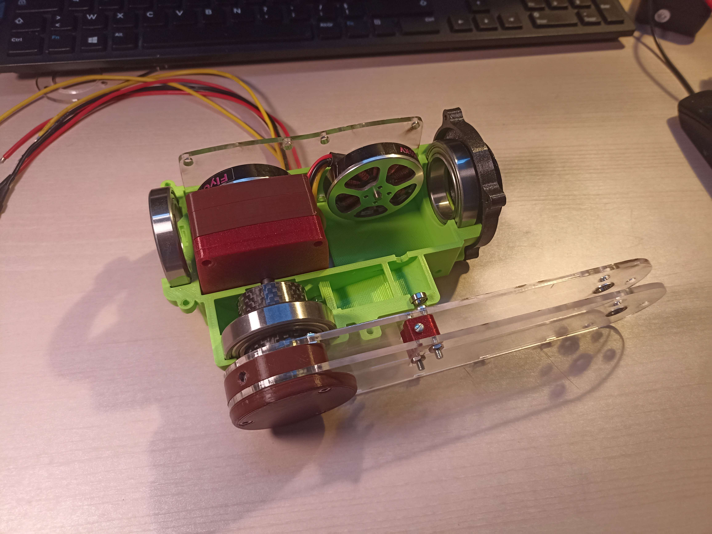
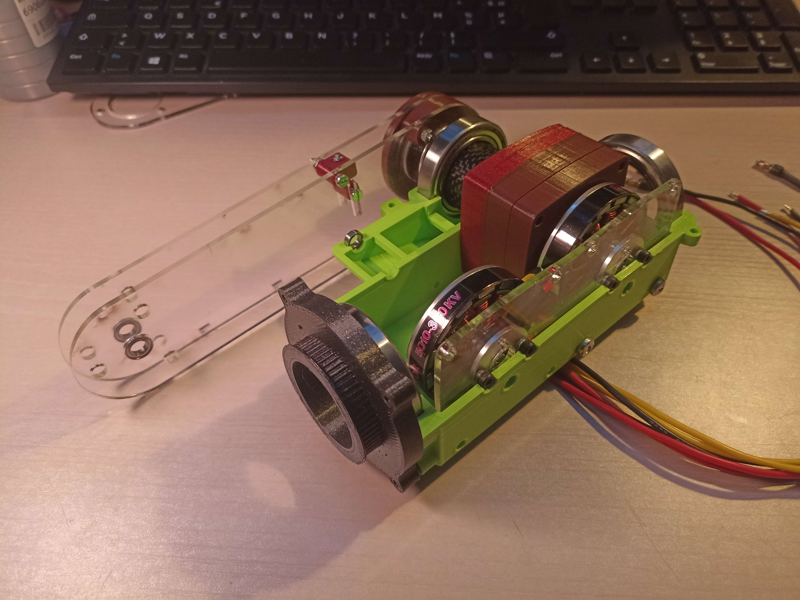

# Week 6 - February 7, 2022 - 122h

## Installation of the potentiometers

We now had to install the potentiometers within the system to be able to have a feedback on the position of the joints.

The main difficulties were to design simple, reliable systems with as little change as possible in the design of the robot.

Maximilien Kulbicki took care of the hip joint and I took care of the knee and shoulder joints.

### **1 - The knee**

For the knee, I dismantled the potentiometers to keep only two pieces. This allowed to save a lot of space because the potentiometers were very imposing.

The two parts are a fixed part, having the tracks (the brown part) and a mobile part making the contact between these tracks (the white part).

So I used the steel axis of the joint. This one will be fixed to the tibia and will turn if we move this joint. I fixed the mobile part to it.

And with the help of a 3D printed part I could connect the fixed part to the thigh. These two parts will vary according to the movement and we can know the position.

To connect the axle to the mobile part, I wanted to drill the axle in its length and come to tarod it. Because of the lack of material, the operation seemed complicated. Pascal Masson helped me to find a solution and succeeded in cutting the axis so that it could be assembled directly.

### **2 - The soulder**

For the shoulder I used the same two pieces of the potentiometer. I positioned the mobile part on the shoulder shell and the fixed part on the frame.

The mobile part will be through a carbon tube that will be fixed to the bearing of the shoulder shell.

The fixed part will be attached to a 3D printed part that will be fixed inside the carbon tube.

 

## Assemblage de l'épaule

After finishing the potentiometers and correcting the last errors. We were able to start prototyping a leg.

I printed a version of the shell in a beautiful color and assembled the different components inside.

The parts fit together perfectly and the system has very little play for the moment.

It remains however to print a gearbox and re-cut the steel axes of the system.

 

## Next

The goal is to have a prototype of leg before the next vacations. I think it's possible.

We only have to print a gearbox, cut the steel axles, then make the final assembly with the belts.

 