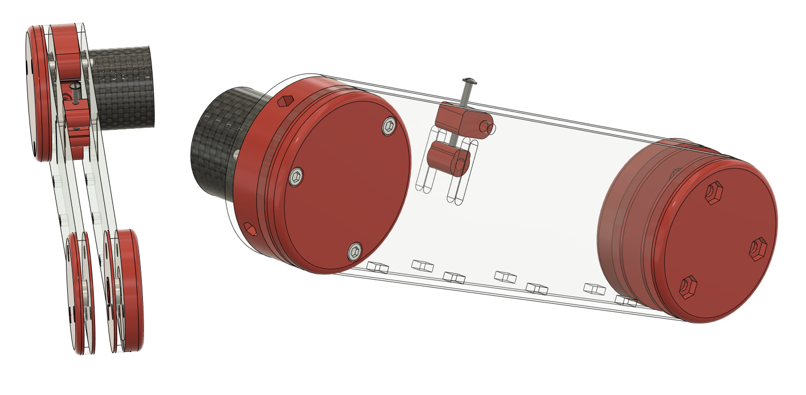
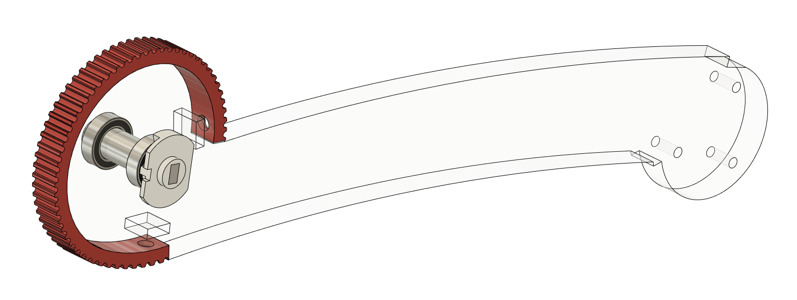
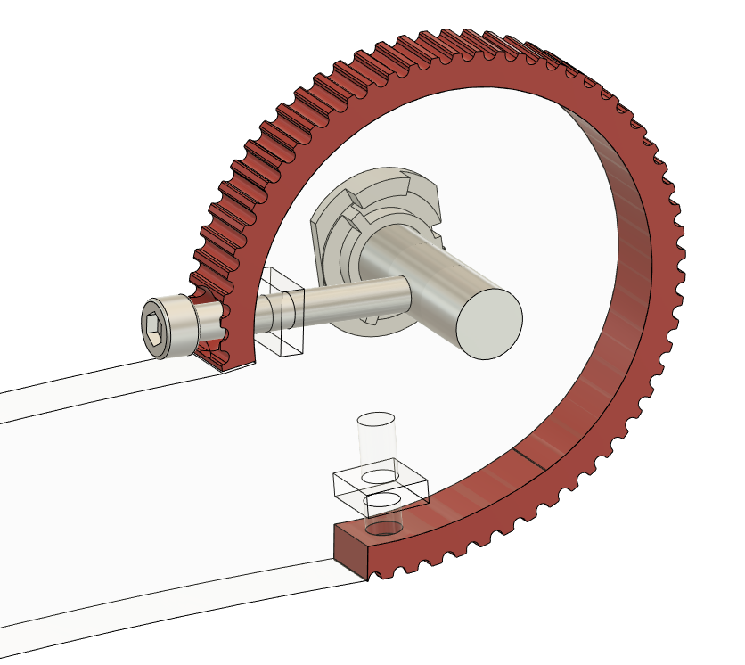

# Week 7 - February 14, 2023 - 128h

## Printing the reducer

We were missing a reducer to finish the leg, so I printed it in PLA and assembled it.

Some parts had a printing problem so I had to go back twice.

We had enough bearings to make two so the gearbox was almost complete, it just lacked the steel shaft for the output rotation.

 

## the assembly of the knee

The knee is composed of two main parts:

- one that we will consider fixed here, it is composed of the two plates of the thighs, the external protections and the potentiometer.

- the second one which is mobile, it is composed of the tibia, the steel axis and the second part of the potentiometer.

I had to re-cut the plexiglass plate of the second part. I also had to find a solution to fix the steel axis to the plexiglass plate.

So I chose to use the same technique used in [the reducers](https://github.com/RonanLc/Snoopytech/blob/main/doc/Rapports/Reports%20-%20Ronan%20Le%20Corronc/Session_11.md). I drilled the plate in its length and came to screw in a screw pressing on the rod.

I also soldered 3 wires on the potentiometer to allow to get the position of the potentiometer.

We tested the values it returns but we have a problem with it, it only works on a certain range then returns 0 afterwards. I suspect that the potentiometer track was scratched during disassembly or assembly. We will have to correct this problem.

The leg is fully assembled and fits perfectly with the shoulder.

Maximilien took care of re-cutting the axles for the reducers and so we will be able to connect all the systems together with the belts.

 

## Next

The goal is now to make the first tests of movement with the leg and torque tests.

After that we will be able to focus on the position control of the leg and the production of the 3 other legs!

 