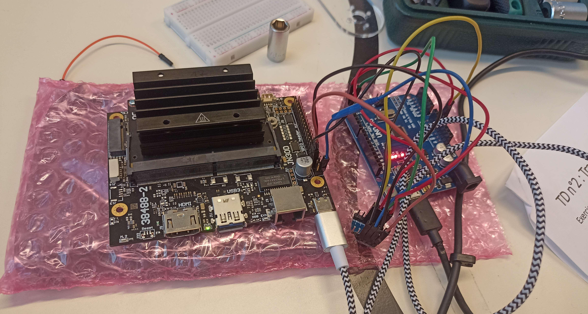
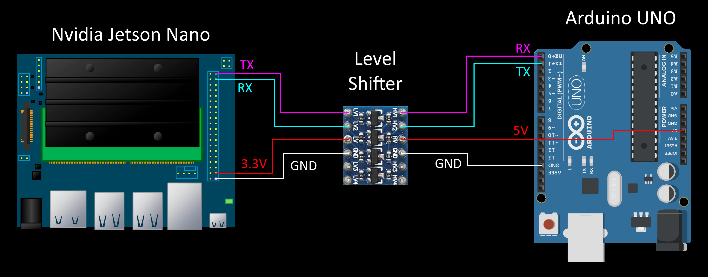

# Week 10 - March 7, 2023 - 136h

## Communication in Nvidia Jeston nano and Arduino UNO

The goal here is to be able to communicate between the two boards. 

The Arduino board will be used as a low level board, it will apply the commands of the Nvidia and will control the different sensors and motors.
The Nvidia card will be used to perform all the calculations and data analysis to determine the movements of the robot.

The two cards must be able to communicate with each other without stopping.



<br>


## Wiring

The wiring is quite simple, you just have to connect the RX of the arduino to the TX of the Nvidia. Then connect the RX of the Nvidia to the TX of the arduino.

But when I looked a little bit more closely, I noticed a problem. The serial communication of the Nvidia works in 3.3V unlike the arduino which works in 5V. In the direction Nvidia -> Arduino, this is not a problem, the arduino will be able to read the bits received in 3.3V. But in the opposite direction you have to lower the voltage, the 5V can damage the Nvidia card.

I thought at first to use only a voltage divider bridge. But according to my research, it works very well at low frequency, but by increasing the communication speed, we risk to lose a lot of bits.

The solution was to add a level shifter, a small component designed for this use allowing to communicate with two different voltages.

So the wiring is like this:




<br>


## Programming

The code is composed of two scripts, one in C that is run on the arduino and one in Python run on the Nvidia.

The ``Python`` code is as follows:

```Arduino
void setup(){
  Serial.begin(115200);
  while(!Serial){;}
}

const char stopPoint = '|';

void loop(){

  if (Serial.available()>0) {

    String commandFromJetson = Serial.readStringUntil(stopPoint);

    String ackMsg = "Message :" + commandFromJetson;

    Serial.print(ackMsg);
  }
  
  delay(500);
}
```

Here the code is only designed to receive a message from the serial communication and display it on the serial monitor.

The ``Python`` code is as follows:

```Python
import serial
import time

#arduino = serial.Serial('/dev/ttyAcM0', 115200, timeout=5)

arduino = serial.Serial(
port = '/dev/ttyACM0',
baudrate = 115200,
byterate = serial.EIGHTBITS,
parity = serial.PARITY_NONE,
stopbits = serial.STOPBITS_ONE,
timeout = 5,
xonxoff = False,
rtscts = False,
dsrdtr = False,
writeTimeout = 2)

while True:
    try:
        arduino.write("Command from Jetson|".encode())
        data = arduino.readline().decode()
        if data:
            print(data)
        time.sleep(1)
    except Exception as e:
        print(e)
        arduino.close()
```

This code is designed to first set the communication port and then, if everything works well, send the data to the arduino via the serial link. I use the ``serial`` library for that.

<br>


## Next

For the moment the communication works only by connecting the Arduino board in USB to the Nvidia. The Nvidia board has only one USB port which is already used for the camera, so we have to free it by using the RX/TX pins. Unfortunately the communication does not work via these ports. The problem seems to come from the port declaration in the Python script, the port used is not the right one.

So I will have to find the right port and redo some tests to have a reliable and functional communication.