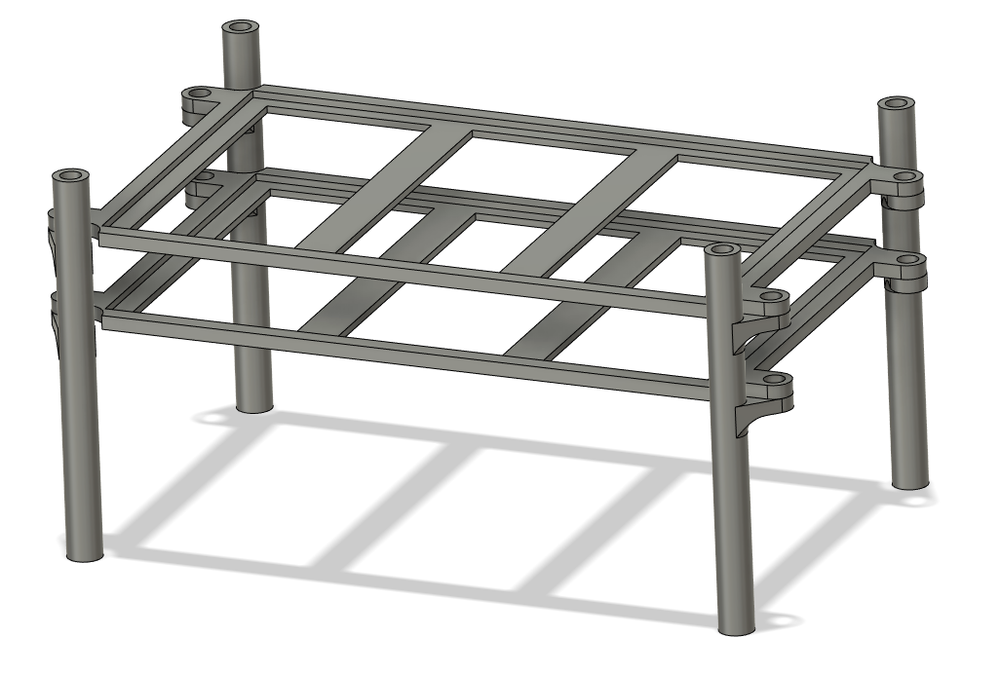

# Week 11 - March 13, 2023 - 140h

During this session I concentrated on printing parts. The robot's paste being soon finished, we have to print all the parts to be able to build the three others quickly.

So I printed some parts that were already working.

## Gearbox

 

## ESC bed

The ESC beds are not very strong though. They bend when I hang all the ESCs on them, so I would have to modify them to fit more rigidly.

 

## Shoulder case

The shoulders had to be reprinted many times because a lot of movements take place inside, we encountered many conflicts.

 

## Next

I continue to print parts as soon as possible and modify them when necessary to finish the robot as soon as possible.