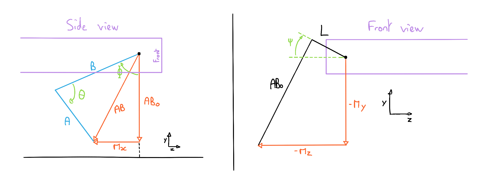

# Week 14 - April 4, 2023 - 155h

I determined last week the direct equations, so now I have to find the inverse equations.

To do this I based myself on the same diagrams.

## Inverse equations

So I was able to determine the following equations:
$$ \textcolor{red}{ABo} = AB \times cos(\textcolor{green}{\Phi} - arcsin( \frac{A \times sin(\textcolor{green}{\Theta})}{AB})) $$

$$ \textcolor{green}{\Theta} = arccos( \frac{A^2 + B^2 + \textcolor{red}{Mx}^2 + \textcolor{red}{ABo}^2}{2 \times \sqrt{\textcolor{red}{Mx}^2 + \textcolor{red}{ABo}^2}}) $$

$$ \textcolor{green}{\Psi} = arctan(\frac{\textcolor{red}{My}}{\textcolor{red}{Mz}}) - arcsin(\frac{L}{\sqrt{\textcolor{red}{Mz}^2 + \textcolor{red}{My}^2}}) $$

These equations correspond to the inverse equations, they allow to find the angles of the leg by knowing the X, Y, Z positions.

Unfortunately I was not able to find the Phi angle equation. I tried the other equations with numerical values and the results seem inconsistent.

## Next

I will have to re-study these equations as they seem to be incorrect.
