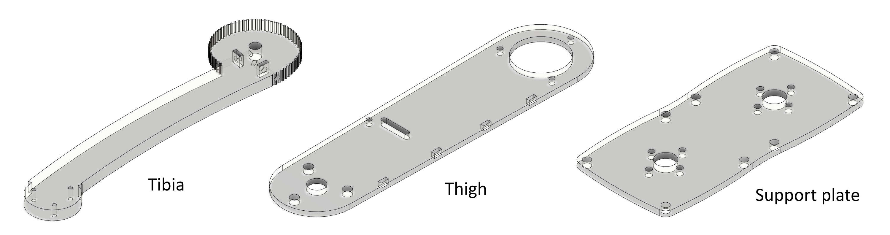
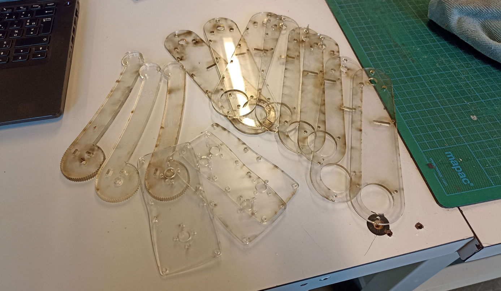
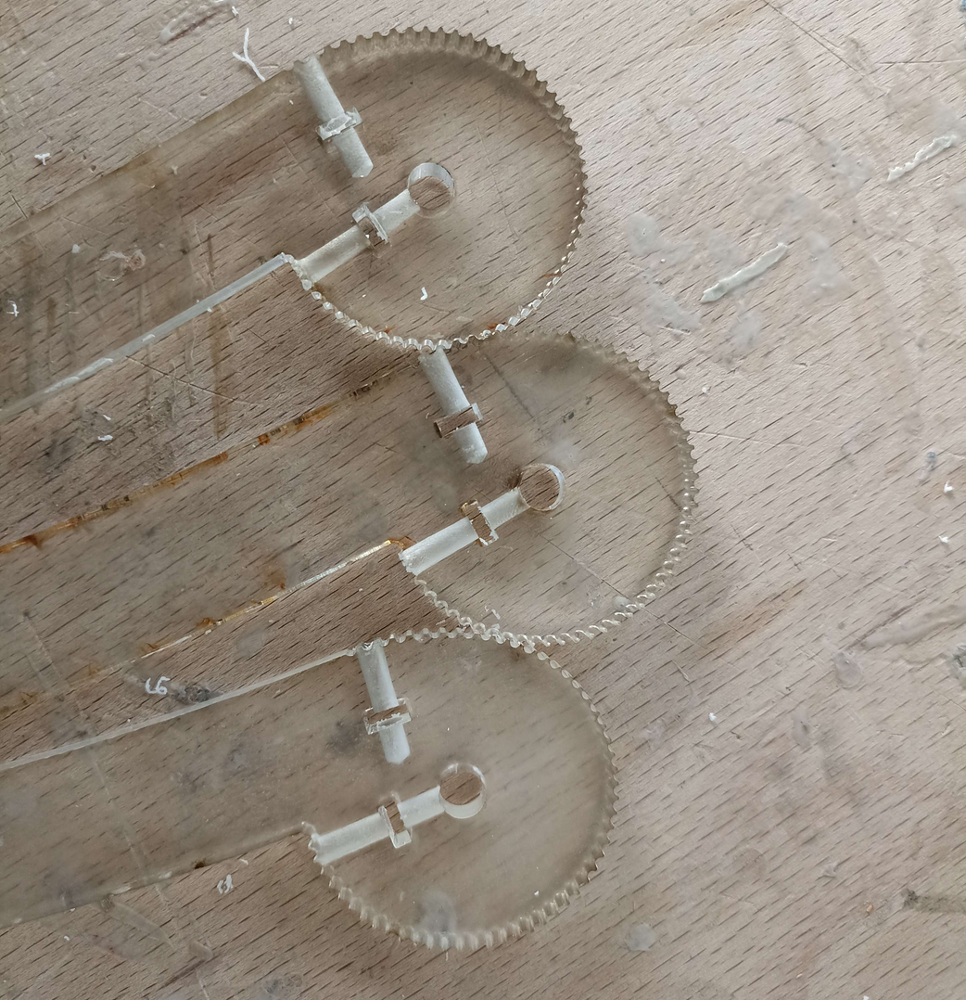

# Week 17 - April 25, 2023 - 174h

Our prototype leg being finished and functional, it was now time to make the 3 other legs. So I concentrated on this part.

## 3D parts printing

Each leg requires many 3D printed parts. I used my personal printer to be able to print all these parts, this allowed us to save time and productivity. So we had these parts to print:

- 2 shoulder boxes (10:22 printing time each) 
- 3 complete reducers (7h48 of printing each)
- All the parts used for the articulations of the leg (9h12 of printing)

That is to say a total, when the printing goes well, of 53h20 of printing per leg. We still had to print some extra parts because it happened that some prints failed.

 

## Plexiglass cutting

To save time, the legs are made of plexiglass. So we had to cut the plexiglass plates with a laser cutter.

There was a total of 12 pieces to cut, for one leg :

- 1 tibia
- 2 thighs
- 1 support plate for the motors

After cutting the tibia, I had to drill them with a dremel in their length to be able to put screws to hold the straps.

 

## Next

Now that we have all the parts we will concentrate on the assembly of the legs and the reducers.