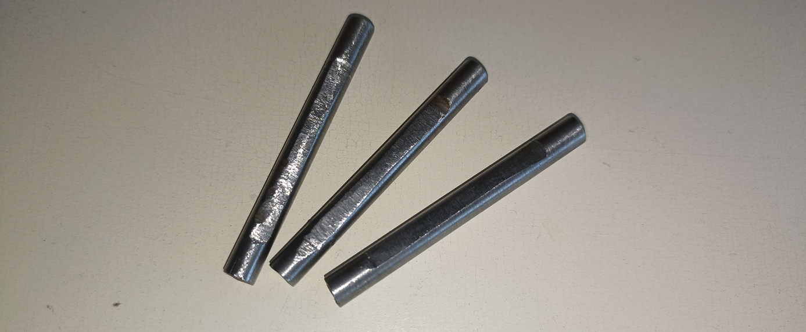
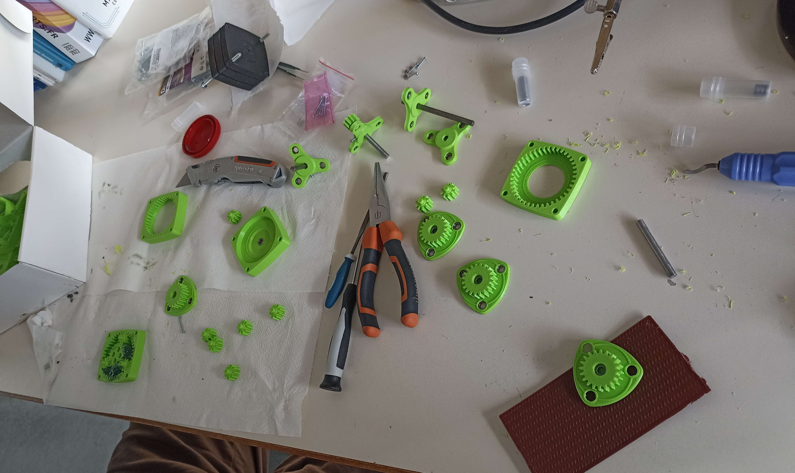
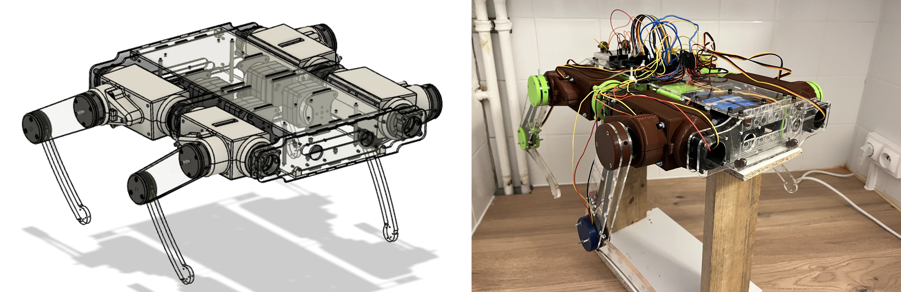

# Week 18 - May 2, 2023 - 148h

During the previous session, we had printed and cut out all the necessary parts to make the 4 legs. We then assembled all these pieces to make the legs.

## Reducers

We had to assemble the 9 remaining gearboxes. I cut and machined the steel rods that will be used as the output shaft of the gearbox. I had to take the right dimensions and then cut a false flat to be able to fit it in the gearbox with a screw as explained in [Report No. 11](https://github.com/RonanLc/Snoopytech/blob/main/doc/Rapports/Reports%20-%20Ronan%20Le%20Corronc/Session_11.md).

Once this was done I had to trim the 3D printed parts. When a part is printed in 3D the first layers are more crushed according to the height of the plate. They are therefore wider and the reducer being designed to the nearest millimeter, these wider layers pose a problem during assembly. I had to cut them on each piece to assemble the gearbox correctly.

After that I was able to add the bearings in the parts with a press (not having a press available I used a large pliers). Then I installed the steel axle.

I then gave the different parts to Maximilien so that he could grease the gears and close them permanently.

 

## Next

We were able to assemble the legs during our personal time and then install the legs on the chassis. We were able to have a fully assembled robot to finish this project.

