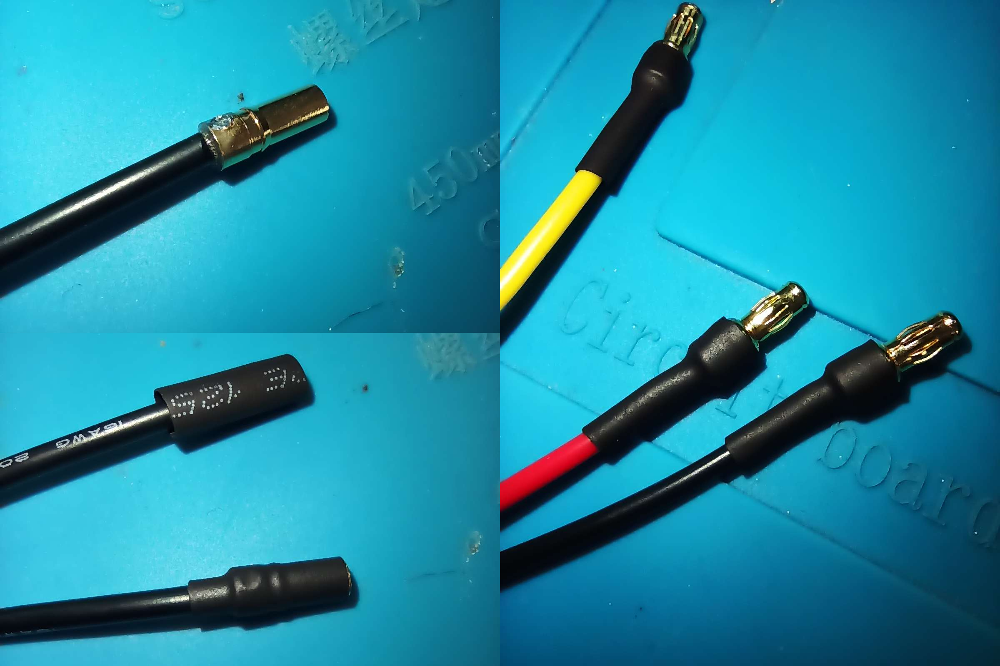
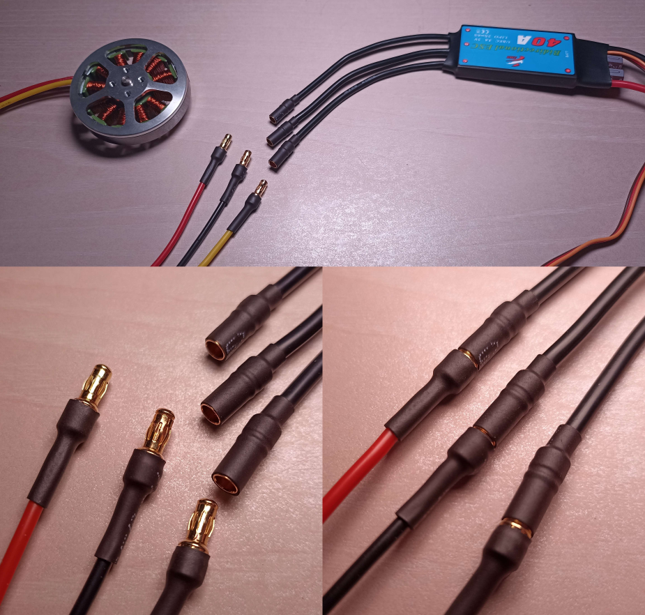
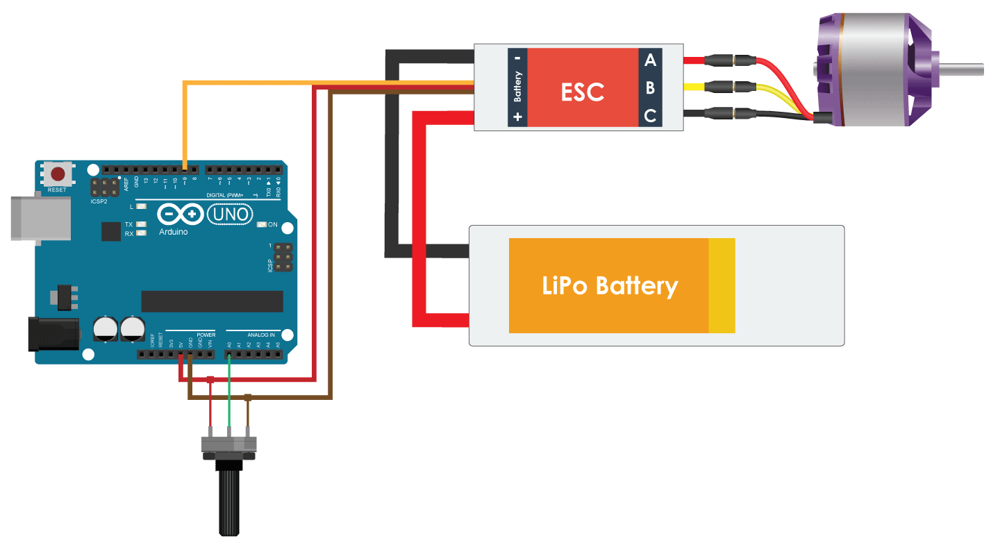

# Week 45 - November 25, 2022 - 30h

We received the last components at the beginning of the session so I focused my session on working on the motors.


*Green: components received / Blue: components waiting / Red: components without information*

We now have all the main components to build the robot.

<br>

# Préparations des moteurs

Before starting to use the motors, some preparation has to be done. Here we received connectors with the motors so I decided to solder them to the motors and ESCs to easily connect them.



Motors and ESCs can therefore be easily connected and disconnected.



<br>

## Electric assembly

Thanks to these connectors I could assemble the electrical system for the motors. It is composed of a motor, an esc, and an arduino board and a potentiometer to drive the motor.

the electrical circuit is composed as follows:



The LiPo battery here has been replaced by a DC voltage generator set to 15V to simulate the connection to a LiPo 4S.

The potentiometer will be used to select the speed of rotation of the motor and its orientation.

<br>

## Motor programming

Many methods exist to control the motor, or to control the esc. Here I use an arduino board and after many tests I discovered that some ESCs can be controlled the same way as a servo motor.

That is to say that it is controlled by PWM. This allows to indicate to the ESC the desired motor speed.

So I tested a very simple program using the arduino library for servo motors.

```ino
#include <servo.h>
```
The program works in a very simple way. It recovers the value that the potentiometer returns (corresponding to its position) and converts it in a proportional way to send it in pwm to the ESC.

```ino
#include <Servo.h>

Servo esc;
int pot;

const int pinPot = A0;
const int pinEsc = 5;

void setup() {
  esc.attach(pinEsc, 1000, 3000);
  Serial.begin(9600);
}

void loop() {
  pot = map(analogRead(pinPot), 0, 1023, 0, 180);
  Serial.println(pot);
  esc.write(pot);
  delay(10);
}
```

And here are the very first turns of the motor of our future robot!

[](https://youtu.be/H11FsNPKSh8)
*Click to view the YouTube video.*

During this test I noticed two things. First, the motor doesn't seem to be going at its maximum speed so the pulse durations of the pwm would have to be changed. Second, the PWM is also used to change the direction of rotation of the motor.

The next command allows to choose the orientation of the servo motor normally. It supports an input from 0 to 180.

```ino
esc.write(90);
```

From ``90`` to ``0`` the motor turns in one direction.

*0 is supposed to be the maximum speed of the motor.*

<br>

And from ``90`` to ``180`` the motor turns in the other direction.

*180 being supposed to be the maximum speed of the motor.*

<br>

## Next week

We will start building the robot. The conception is almost finished which will allow to do the first tests of the legs in the next sessions.

The library for the servo motor works well but it is not optimized for brushless motors, at least not for this ESC.

So I'll be interested in the programming of the motor and find codes to exploit 100% the possibilities of the motor. I will also try to drive several motors at the same time.