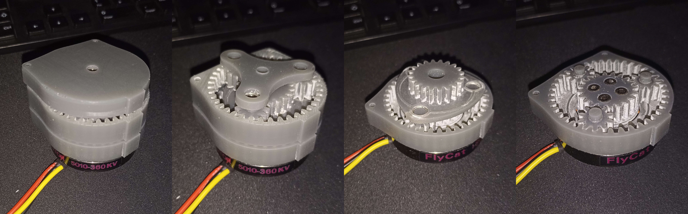
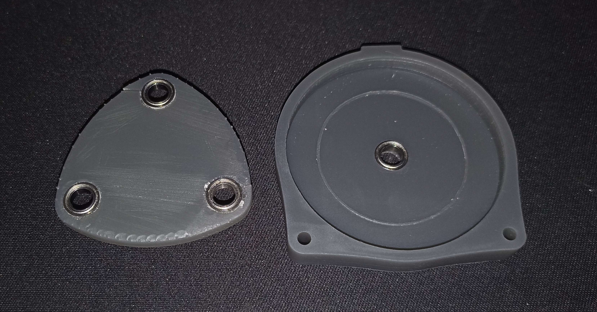

# Week 50 - December 16, 2022 - 72h

## Gearbox printing

So I changed the uncertainty of the parts and I reprinted them. This time I did not have any problem during the printing and the system is correctly mounted.

I still have some corrections to make because the box doesn't close due to offsets (like on the picture on the left).

The gears are white because of the friction between the parts, the parts wear while turning and the resin tends to whiten very quickly. But the parts are still efficient before turning.

The friction is still a problem, despite the reduced tolerance. The motor still manages to turn the parts easily but it would be better to apply **grease** to the final assembly.

After discussing with a teacher we also concluded that we could use sheets of **teflon** under the gears to limit the friction with the fixed parts.

Limiting this friction would in first, **limit the wear of the parts** and in second, **limit the heating of the system**.

We were still able to install the bearings in the parts.

 

## Tests
We have verified that the reduction ratio is indeed 1/3 for one stage and we could test to make the motor turn with the reducer.

The reducer makes a lot of noise due to the gear play and the noise of the plastic but this should be manageable with some grease.

 

## Next session

So I will continue to work on the reducers and the goal of the next session will be to have a finished reducer of the right size to be able to print several of them.